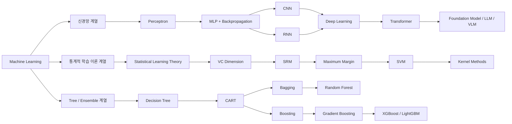
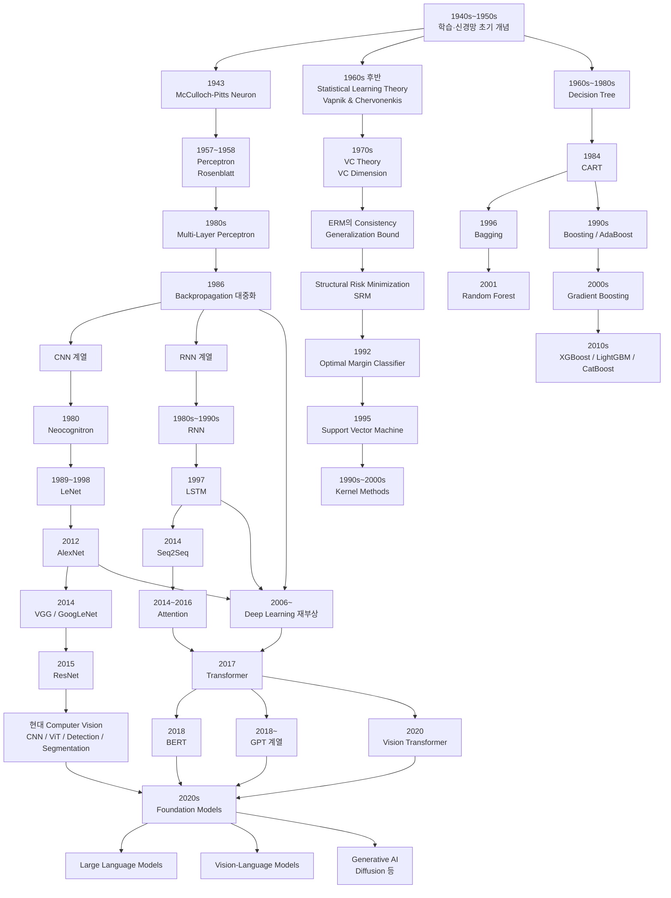

# AI 학습 계보

```mermaid
flowchart LR

    A["Machine Learning"]

    A --> B["신경망 계열"]
    A --> C["통계적 학습 이론 계열"]
    A --> D["Tree / Ensemble 계열"]

    B --> B1["Perceptron"]
    B1 --> B2["MLP + Backpropagation"]
    B2 --> B3["CNN"]
    B2 --> B4["RNN"]
    B3 --> B5["Deep Learning"]
    B4 --> B5
    B5 --> B6["Transformer"]
    B6 --> B7["Foundation Model / LLM / VLM"]

    C --> C1["Statistical Learning Theory"]
    C1 --> C2["VC Dimension"]
    C2 --> C3["SRM"]
    C3 --> C4["Maximum Margin"]
    C4 --> C5["SVM"]
    C5 --> C6["Kernel Methods"]

    D --> D1["Decision Tree"]
    D1 --> D2["CART"]
    D2 --> D3["Bagging"]
    D2 --> D4["Boosting"]
    D3 --> D5["Random Forest"]
    D4 --> D6["Gradient Boosting"]
    D6 --> D7["XGBoost / LightGBM"]
```
---

```mermaid
flowchart TD

    A["1940s~1950s<br/>학습·신경망 초기 개념"]

    %% Neural Network lineage
    A --> NN0["1943<br/>McCulloch-Pitts Neuron"]
    NN0 --> P["1957~1958<br/>Perceptron<br/>Rosenblatt"]
    P --> MLP["1980s<br/>Multi-Layer Perceptron"]
    MLP --> BP["1986<br/>Backpropagation 대중화"]

    BP --> CNN0["CNN 계열"]
    BP --> RNN0["RNN 계열"]

    CNN0 --> NEO["1980<br/>Neocognitron"]
    NEO --> LENET["1989~1998<br/>LeNet"]
    LENET --> ALEX["2012<br/>AlexNet"]
    ALEX --> VGG["2014<br/>VGG / GoogLeNet"]
    VGG --> RES["2015<br/>ResNet"]
    RES --> MODERNCV["현대 Computer Vision<br/>CNN / ViT / Detection / Segmentation"]

    RNN0 --> RNN["1980s~1990s<br/>RNN"]
    RNN --> LSTM["1997<br/>LSTM"]
    LSTM --> SEQ["2014<br/>Seq2Seq"]
    SEQ --> ATT["2014~2016<br/>Attention"]

    %% Statistical Learning Theory lineage
    A --> SLT["1960s 후반<br/>Statistical Learning Theory<br/>Vapnik & Chervonenkis"]

    SLT --> VC["1970s<br/>VC Theory<br/>VC Dimension"]
    VC --> ERM["ERM의 Consistency<br/>Generalization Bound"]
    ERM --> SRM["Structural Risk Minimization<br/>SRM"]
    SRM --> MARGIN["1992<br/>Optimal Margin Classifier"]
    MARGIN --> SVM["1995<br/>Support Vector Machine"]
    SVM --> KERNEL["1990s~2000s<br/>Kernel Methods"]

    %% Tree / ensemble lineage
    A --> TREE["1960s~1980s<br/>Decision Tree"]
    TREE --> CART["1984<br/>CART"]
    CART --> BAG["1996<br/>Bagging"]
    CART --> BOOST["1990s<br/>Boosting / AdaBoost"]
    BAG --> RF["2001<br/>Random Forest"]
    BOOST --> GBM["2000s<br/>Gradient Boosting"]
    GBM --> XGB["2010s<br/>XGBoost / LightGBM / CatBoost"]

    %% Deep learning
    BP --> DL["2006~<br/>Deep Learning 재부상"]
    ALEX --> DL
    LSTM --> DL

    DL --> TRANS["2017<br/>Transformer"]
    ATT --> TRANS

    TRANS --> BERT["2018<br/>BERT"]
    TRANS --> GPT["2018~<br/>GPT 계열"]
    TRANS --> VIT["2020<br/>Vision Transformer"]

    BERT --> FM["2020s<br/>Foundation Models"]
    GPT --> FM
    VIT --> FM
    MODERNCV --> FM

    FM --> LLM["Large Language Models"]
    FM --> VLM["Vision-Language Models"]
    FM --> GEN["Generative AI<br/>Diffusion 등"]
```
