# Jetson Orin Nano 기반 조류 퇴치 시스템 모델별 선정 근거 보고서

## Executive summary

본 보고서는 Jetson Orin Nano 8GB에서 **RGB 영상 기반 조류 종 탐지·추적·행동 분류·퇴치 정책 선택**을 실시간으로 수행한다는 전제에서 모델 후보를 비교한다. 업로드된 현장 실험 계획의 엣지 장치 구성과 실험 흐름을 기본 운용 맥락으로 삼았다. fileciteturn0file0

Jetson Orin Nano 8GB Super 구성은 최대 67 INT8 TOPS, 8GB LPDDR5 공유 메모리, 최대 102GB/s 메모리 대역폭과 25W 또는 MAXN SUPER 운용 모드를 제공한다. 그러나 DLA와 PVA가 없기 때문에 탐지, 비디오 분류, NvDCF 추적이 모두 GPU와 공유 메모리를 사용한다. 따라서 단순한 모델 정확도보다 **배치 크기 1에서의 실제 지연, 모델 동시 상주 메모리, 영상 디코딩·전처리를 포함한 전체 파이프라인 지연**이 더 중요하다. citeturn8search0turn8search2turn8search11

가장 현실적인 최초 배포 조합은 다음과 같다.

| 시스템 기능           | 우선 권장                                     | 차선 또는 비교 후보                    | 선정 판단                                                     |
| ---------------- | ----------------------------------------- | ------------------------------ | --------------------------------------------------------- |
| 통합 조류 종·사람·차량 탐지 | **YOLO11s, TensorRT FP16**                | YOLO11n, D-FINE-S, RT-DETRv2-S | YOLO11s가 정확도·지연·배포 도구·커뮤니티의 균형이 가장 좋음                     |
| 객체 추적            | **ByteTrack**                             | OC-SORT                        | ByteTrack은 가장 단순하고 가벼움. 새의 비선형 비행에서 ID 단절이 많으면 OC-SORT 전환 |
| 종 분류 보완          | **MobileNetV3-Large**                     | EfficientNet-B0                | 통합 탐지기의 종 분류가 불충분할 때만 Track crop에 실행                      |
| 행동 분류            | **MobileNetV3 + TSM**                     | 2D CNN + GRU, MoViNet-A0       | 시간 정보를 처리하면서 추가 계산량이 작고 사건 발생 시에만 실행 가능                   |
| 사건 구성            | **FSM Event Manager**                     | HMM은 후속 연구                     | 별도 신경망보다 설명 가능한 상태 전이가 적합                                 |
| 퇴치 정책            | **Contextual Bandit + Thompson Sampling** | 고정 규칙, UCB                     | 사건별 온라인 갱신과 탐색·활용 균형에 적합                                  |
| 행동별 성공률          | **Beta-Bernoulli posterior**              | LightGBM                       | 초기 데이터가 적을 때 안정적이고 즉시 업데이트 가능                             |
| 출현·효과 예측         | **서버 LightGBM**                           | XGBoost                        | 현장 데이터가 누적된 뒤 날씨·NDVI·시간대 효과를 모델링                         |

**DETR 계열이 YOLO보다 항상 우수한 것은 아니다.** D-FINE-S와 RT-DETRv2-S는 COCO AP에서 비슷한 규모의 YOLO 모델보다 우수한 수치를 보이지만, 공식 지연시간은 주로 T4 GPU에서 측정됐으며 Jetson의 연산자 지원, TensorRT 엔진 빌드, 메모리 사용량, 후처리 통합까지 포함하면 YOLO11s가 최초 현장 배포의 위험이 더 낮다. D-FINE-S는 정확도 우선 비교 모델로 가치가 높지만, 생산 기준선은 YOLO11s가 적절하다. citeturn17view0turn13search3turn13search8

COCO AP는 과수원 원거리 조류 성능을 직접 보장하지 않는다. 최종 모델은 반드시 자체 영상에서 `AP_small`, 거리 구간별 recall, 수관 가림 recall, 종별 confusion, 탐지부터 퇴치 개시까지의 지연을 기준으로 결정해야 한다.

## 평가 기준과 Jetson 운용 제약

공식 벤치마크의 지연시간은 동일 조건이 아니다. YOLO11은 T4 TensorRT 10, YOLOv8은 A100 TensorRT, RT-DETR와 D-FINE은 주로 T4 TensorRT FP16, EfficientDet-Lite와 MoViNet은 Pixel 4 CPU 또는 모바일 가속기에서 측정됐다. 따라서 아래 표의 지연시간은 **모델군의 상대적인 복잡도를 이해하는 참고값**이며 Jetson Orin Nano의 예상 지연시간으로 직접 대입할 수 없다. citeturn17view0turn17view1turn13search3turn13search8turn18search3turn9search10

표의 메모리 수치는 공식 모델 파일 크기가 아니라 다음 조건을 가정한 **배포 계획용 추정 범위**다.

- TensorRT FP16, batch 1
- 표시된 고정 입력 크기
- 엔진 가중치, activation, 입출력 tensor, 일부 workspace 포함
- 카메라 디코더, GStreamer 버퍼, 원본 영상 버퍼, 운영체제 메모리 제외

TensorRT는 엔진 빌드와 실행 과정에서 가중치 외에도 입력·출력·activation·temporary workspace를 사용하며, 동적 shape와 넓은 optimization profile은 메모리 사용을 증가시킨다. 실제 수치는 `trtexec`, `tegrastats`, Nsight Systems로 확인해야 한다. citeturn8search7turn8search12turn8search3

우선순위는 다음 가중 판단을 적용했다.

\[
Priority =
0.35 \times RealTime
+0.30 \times Deployability
+0.25 \times SmallObjectSuitability
+0.10 \times LicenseAndSupport
\]

여기서 작은 객체 적합성은 COCO 전체 AP만으로 판단하지 않고, 입력 해상도 확장 가능성, 다중 스케일 특징, 탐지 recall, 후처리 안정성, 자체 데이터 튜닝 가능성을 함께 고려했다.

## 탐지 및 종 분류 모델 비교

조류 종을 탐지 모델의 class로 직접 정의하면 탐지와 종 분류를 하나의 모델로 합칠 수 있다. 예를 들어 `magpie`, `crow`, `bulbul`, `sparrow`, `pigeon`, `unknown_bird`, `person`, `vehicle`을 동일한 detector에서 출력하고, 같은 Track에서 여러 프레임의 class probability를 누적해 종을 확정한다.

\[
\hat{c}_{track}
=
\arg\max_{c}
\sum_{t=1}^{T} w_t p(c\mid x_t)
\]

다만 새가 수십 픽셀에 불과하면 위치는 탐지해도 종 특징은 보이지 않을 수 있다. 이 경우 통합 detector를 버리는 것이 아니라 `bird/unknown_bird`로 탐지한 뒤 품질이 좋은 Track crop만 MobileNetV3 또는 EfficientNet-B0에 전달하는 **조건부 2단계 분류**가 적합하다.

### 탐지 모델 비교표

| 모델명 | 용도 | COCO/참고 벤치마크 AP 또는 정확도 | 추론 지연, TensorRT FP16 기준 | 메모리·VRAM 요구 추정 | 권장 입력 해상도 | Jetson 배포 난이도 | TensorRT 변환 지원 | 장점 | 단점 | 추천 우선순위 | 비고 |
|---|---|---:|---:|---:|---|---|---|---|---|---|---|
| YOLO11n | 통합 탐지 | COCO AP 39.5, 2.6M params, 6.5 GFLOPs. citeturn17view0 | T4 TRT10 1.5ms. citeturn17view0 | 약 0.35–0.7GB | 640; 원거리 조류는 768–960 또는 ROI tiling | 낮음 | 예, 공식 export | 매우 빠름.<br>동시 행동 모델 상주 여유가 큼.<br>배포 자료가 풍부함. | 작은 새 recall이 s보다 낮을 가능성.<br>복잡한 수관에서 오탐 증가 가능.<br>정확도 여유가 작음. | 높음 | 속도 우선 fallback. P3/8 출력 사용, NMS 필요. AGPL-3.0 또는 Enterprise 라이선스. citeturn13search0turn13search9 |
| YOLO11s | 통합 탐지 | COCO AP 47.0, 9.4M params, 21.5 GFLOPs. citeturn17view0 | T4 TRT10 2.5ms. citeturn17view0 | 약 0.55–1.1GB | **640 기본**, 작은 새 성능 부족 시 768 또는 960 | 낮음 | 예, 공식 export | 정확도와 속도의 균형이 우수.<br>Jetson·TensorRT 자료가 많음.<br>탐지·분류 통합이 쉬움. | NMS 후처리 필요.<br>AGPL 조건 검토 필요.<br>고해상도 사용 시 부하 증가. | **매우 높음** | **최초 현장 배포 권장 모델.** 종 class별 최소 수백~1,000개 이상의 다양한 instance를 시작점으로 권장하나 이는 현장 경험적 기준임. |
| YOLO11m | 통합 탐지 | COCO AP 51.5, 20.1M params, 68 GFLOPs. citeturn17view0 | T4 TRT10 4.7ms. citeturn17view0 | 약 0.9–1.8GB | 640 | 중간 | 예 | s보다 높은 정확도.<br>가림·배경 다양성에 더 큰 표현력.<br>서버 학습 기준선으로 유용. | 행동 모델과 동시 운용 시 메모리 압박.<br>25W·냉각 의존도가 높음.<br>현장 전체 지연이 증가. | 중간 | 탐지 정확도가 시스템 병목임이 확인된 경우에만 채택. |
| YOLOv8n | 통합 탐지 | COCO AP 37.3, 3.2M params, 8.7 GFLOPs. citeturn17view1 | A100 TRT 0.99ms. citeturn17view1 | 약 0.35–0.75GB | 640 | 낮음 | 예 | 매우 성숙한 생태계.<br>Jetson 사례가 많음.<br>디버깅이 쉬움. | YOLO11n보다 공식 AP가 낮음.<br>새 프로젝트에서 세대상 이점이 작음.<br>NMS 필요. | 중간 | 기존 YOLOv8 코드·학습 자산이 있을 때 유효. AGPL-3.0/Enterprise. |
| YOLOv8s | 통합 탐지 | COCO AP 44.9, 11.2M params, 28.6 GFLOPs. citeturn17view1 | A100 TRT 1.20ms. citeturn17view1 | 약 0.6–1.25GB | 640 | 낮음 | 예 | 검증된 실무 기준선.<br>추적·DeepStream 예제가 풍부.<br>학습 도구가 안정적. | YOLO11s보다 AP·파라미터 효율이 열세.<br>NMS 필요.<br>라이선스 검토 필요. | 중간 | 기존 시스템 호환성 비교용. 신규 기본 선택은 YOLO11s가 우세. |
| RT-DETR-R18 | 통합 탐지 | COCO AP 46.5, 20M params, 60 GFLOPs. citeturn2search10turn13search3 | T4 TRT FP16 약 217 FPS, 약 4.6ms. citeturn2search10 | 약 1.0–2.0GB | 640 | 중간–높음 | 예, 공식 ONNX/TRT 논의 | End-to-end, NMS 불필요.<br>후처리가 단순함.<br>정확도·속도 균형이 양호. | YOLO11s보다 무거움.<br>Jetson 메모리와 attention latency 확인 필요.<br>배포 사례가 YOLO보다 적음. | 중간 | Apache-2.0. 작은 객체 우위는 자체 APS 검증이 필요함. citeturn19view1 |
| RT-DETRv2-S | 통합 탐지 | COCO AP 48.1, 20M params, 60 GFLOPs. citeturn13search3 | T4 TRT FP16 약 217 FPS. citeturn2search10 | 약 1.0–2.0GB | 640 | 중간–높음 | 예 | RT-DETR-R18보다 높은 AP.<br>NMS-free.<br>공식 PyTorch 구현과 custom tuning 제공. | YOLO보다 엔진·후처리 통합 검증 작업이 많음.<br>메모리 여유가 작아짐.<br>고해상도 profile 비용이 큼. | 중간–높음 | **정확도 비교 후보.** Apache-2.0. |
| D-FINE-N | 통합 탐지 | COCO AP 42.8, 4M params, 약 7 GFLOPs. citeturn3search3turn13search8 | T4 TRT FP16 약 2.12ms. citeturn3search3 | 약 0.45–0.9GB | 640 | 중간 | 예, 공식 ONNX와 `trtexec` 절차 | Nano급에서 높은 AP.<br>NMS-free DETR 계열.<br>경계 회귀 효율이 좋음. | Jetson 실전 사례가 YOLO보다 적음.<br>일부 ONNX graph 호환성 점검 필요.<br>커뮤니티 규모가 작음. | 중간–높음 | YOLO11n의 정확도 대안. Apache-2.0이며 공식 FP16 TensorRT export 예제가 있음. citeturn13search8turn19view0 |
| D-FINE-S | 통합 탐지 | COCO AP 48.5, 10M params, 약 25 GFLOPs. citeturn3search3turn13search8 | T4 TRT FP16 약 3.49ms. citeturn3search3 | 약 0.75–1.5GB | 640 | 중간 | 예 | YOLO11s보다 공식 COCO AP가 1.5 높음.<br>정밀한 box 회귀가 장점.<br>NMS가 없음. | T4 기준으로 YOLO11s보다 느림.<br>Jetson 통합 위험이 더 큼.<br>현장 작은 새 우위는 미확정. | **높음, 비교용** | **YOLO11s와 필수 A/B 후보.** 생산 1차보다는 정확도 challenger로 권장. Apache-2.0. |
| YOLOX-Nano | 통합 탐지 | COCO AP 25.8, 0.91M params, 1.08 GFLOPs, 입력 416. citeturn4search0turn13search2 | 공식 Jetson TRT 공통값 없음 | 약 0.25–0.55GB | 416; 작은 새에는 640 재학습 고려 | 낮음–중간 | 예, 공식 TensorRT 지원 | 매우 가벼움.<br>Apache 라이선스.<br>C++ TensorRT 경로가 존재. | AP가 낮음.<br>원거리 작은 조류에 불리.<br>업데이트와 생태계가 상대적으로 오래됨. | 중간–낮음 | 전력·지연이 절대 우선인 예비 모델. NMS 필요. Apache-2.0. citeturn19view2 |
| YOLOX-Tiny | 통합 탐지 | COCO AP 32.8, 5.06M params, 6.45 GFLOPs, 입력 416. citeturn4search0turn13search2 | 공식 Jetson TRT 공통값 없음 | 약 0.4–0.85GB | 416 또는 640 | 낮음–중간 | 예 | 단순한 anchor-free 구조.<br>TensorRT C++ 예제가 존재.<br>라이선스 제약이 비교적 낮음. | 최신 YOLO보다 정확도 낮음.<br>작은 새 검출에서 해상도 증대 필요.<br>NMS 필요. | 중간 | AGPL 회피가 필요한 연구·제품에서 대체 가치가 있음. Apache-2.0. |
| EfficientDet-Lite0 | 탐지 | COCO AP 25.69, INT8 파일 4.4MB. citeturn18search3 | Pixel 4 CPU 37ms; 공식 TRT FP16 값 없음. citeturn18search3 | 약 0.2–0.5GB | 320 | 중간–높음 | 부분 | 매우 작은 모델.<br>모바일·IoT 지향.<br>INT8 친화적. | TFLite 중심이라 Jetson TensorRT 경로가 비표준.<br>AP가 낮음.<br>후처리 변환 문제가 발생할 수 있음. | 낮음 | NVIDIA GPU보다 모바일 CPU·EdgeTPU에 더 자연스러운 선택. |
| EfficientDet-Lite2 | 탐지 | COCO AP 33.97, INT8 파일 7.2MB. citeturn18search3 | Pixel 4 CPU 69ms; 공식 TRT FP16 값 없음. citeturn18search3 | 약 0.3–0.8GB | 448 | 중간–높음 | 부분 | Lite0보다 정확도가 높음.<br>BiFPN 기반 다중 스케일 특징.<br>모델 파일이 작음. | TensorFlow→ONNX→TRT 변환 복잡성.<br>YOLO11n보다 정확도·도구 측면의 이점이 작음.<br>Jetson 커뮤니티가 제한적. | 낮음 | 특정 TFLite 자산을 재사용해야 할 때만 고려. |

YOLO11s와 D-FINE-S의 COCO AP 차이는 크지 않지만 운영 위험 차이는 의미가 있다. YOLO11s는 학습, export, tracking, TensorRT 실행을 한 프레임워크에서 연결하기 쉽다. D-FINE은 공식 ONNX 및 `trtexec --fp16` 경로를 제공하지만, JetPack·TensorRT 버전 변화에 따른 graph 호환성을 프로젝트에서 직접 관리해야 한다. citeturn17view0turn13search8

작은 조류 성능을 높이기 위해 무조건 모델을 크게 만드는 것보다 다음 조치가 우선이다.

- 조류 예상 진입 구역만 640 또는 768 crop으로 추론
- 4K 원본을 2×2 또는 관심영역 tile로 분할
- P2/4 detection head가 필요한지 별도 실험
- 20m, 30m 등 거리 band별 최소 box pixel 수 기록
- 수관 가림·역광·모션 블러를 학습 데이터에 명시적으로 포함
- 동일 Track의 class 확률을 시간적으로 누적

### 이미지·종 분류 모델 비교표

| 모델명 | 용도 | COCO/참고 벤치마크 AP 또는 분류 정확도 | 추론 지연, TensorRT FP16 기준 | 메모리·VRAM 요구 추정 | 권장 입력 해상도 | Jetson 배포 난이도 | TensorRT 변환 지원 | 장점 | 단점 | 추천 우선순위 | 비고 |
|---|---|---:|---:|---:|---|---|---|---|---|---|---|
| MobileNetV3-Large | 종 분류 | ImageNet-1K Top-1 75.27%, 약 5.48M params, 0.22 GFLOPs. citeturn6search4 | 공식 공통 TRT 값 없음 | 약 0.1–0.3GB | **224×224** | 낮음 | 예 | 매우 가볍고 빠름.<br>TensorRT 표준 연산 중심.<br>Track별 반복 분류에 적합. | 미세 종 구분 정확도는 대형 모델보다 낮을 수 있음.<br>작은 crop 품질에 민감.<br>비슷한 종에는 세부 특징 부족. | **높음** | 통합 detector가 `unknown_bird`를 출력할 때 조건부 실행. Torchvision은 BSD 계열 라이선스. |
| EfficientNet-B0 | 종 분류 | ImageNet-1K Top-1 77.69%, 5.29M params, 0.39 GFLOPs. citeturn6search0 | 공식 공통 TRT 값 없음 | 약 0.15–0.4GB | **224×224** | 낮음–중간 | 예 | 크기 대비 정확도가 좋음.<br>미세한 형태·색 분류에 유리할 가능성.<br>전이학습이 쉬움. | MobileNetV3보다 일반적으로 느림.<br>SE·활성화의 엔진 최적화 확인 필요.<br>저품질 crop에서 이점이 감소. | **높음** | 정확도 우선 종 분류 대안. |
| EfficientNetV2-S | 종 분류 | ImageNet-1K Top-1 84.23%, 21.46M params, 8.37 GFLOPs, 384 입력. citeturn14search7 | 공식 공통 TRT 값 없음 | 약 0.45–1.0GB | 384×384 | 중간 | 예 | 높은 분류 정확도.<br>고품질 근거리 crop에서 세부 종 구분 가능성.<br>서버 teacher로 유용. | 실시간 Track별 분류에는 무거움.<br>384 입력이 메모리 대역폭을 사용.<br>원거리 저해상도 crop에는 모델 크기 이득이 제한됨. | 중간–낮음 | Jetson 상시 모델보다는 서버 검증 또는 낮은 빈도 추론용. |
| ResNet18 | 종 분류·특징 추출 | ImageNet-1K Top-1 69.76%, 11.69M params, 1.81 GFLOPs. citeturn14search0 | 공식 공통 TRT 값 없음 | 약 0.2–0.5GB | 224×224 | 낮음 | 예 | 구조가 단순하고 export가 안정적.<br>디버깅과 재현성이 좋음.<br>TSM·GRU backbone으로 쓰기 쉬움. | 정확도·효율이 최신 경량 모델보다 낮음.<br>파라미터 대비 계산량이 큼.<br>종 분류 최종 모델로는 매력 감소. | 중간 | 안정적 baseline과 행동 모델 backbone 후보. |
| ResNet34 | 종 분류·특징 추출 | ImageNet-1K Top-1 73.31%, 21.80M params. citeturn14search3 | 공식 공통 TRT 값 없음 | 약 0.3–0.7GB | 224×224 | 낮음 | 예 | 단순한 residual 구조.<br>ResNet18보다 표현력이 높음.<br>기존 연구와 비교가 쉬움. | EfficientNet-B0보다 크고 정확도가 낮음.<br>실시간 이점이 제한적.<br>다중 Track 시 부하 증가. | 낮음–중간 | 비교실험용이지 최종 우선 후보는 아님. |
| ConvNeXt-Tiny | 종 분류 | ImageNet-1K Top-1 약 82.52%, 28.59M params, 4.46 GFLOPs. citeturn5search5 | 공식 공통 TRT 값 없음 | 약 0.5–1.1GB | 224×224 | 중간 | 예, op 확인 필요 | 높은 분류 정확도.<br>서버 teacher나 사후 분류에 유용.<br>전이학습 성능이 좋음. | Jetson 상시 실행에는 무거움.<br>탐지·행동 모델과 메모리를 경쟁.<br>LayerNorm 배치·layout 최적화 확인 필요. | 낮음–중간 | 서버 기반 종 라벨 검증 모델로 더 적합. |

통합 탐지기를 우선 적용하고 종 분류기를 항상 병렬로 실행하지 않는 것이 바람직하다. 다음 조건 중 하나를 만족할 때만 secondary classifier를 호출한다.

\[
InvokeClassifier =
(\max p_{species}<\tau_s)
\lor
(class=unknown\_bird)
\lor
(quality_{crop}>\tau_q \land disagreement_{track}=1)
\]

이 방식은 탐지와 종 분류를 합치는 장점을 유지하면서, 어려운 Track에만 추가 계산을 배분한다.

## 행동 분류와 객체 추적 모델 비교

현재 카메라 성능에서 쪼기와 실제 섭식을 안정적으로 구분할 수 없다면 행동 label은 다음처럼 제한하는 것이 타당하다.

```text
FLYING
LANDING
PERCHED
FRUIT_AREA_OCCUPANCY
TAKEOFF
OCCLUDED_OR_UNKNOWN
```

행동 분류기는 전체 프레임에 상시 실행하지 않고, 조류 Track이 생성된 뒤 16–32프레임의 crop이 쌓였을 때 Track당 약 1–2Hz로 실행해야 한다. 착지·이륙은 영상 모델 확률과 속도 변화, 수관 ROI 중첩, 체류시간을 FSM에서 결합한다.

### 행동 분류 모델 비교표

| 모델명 | 용도 | COCO/참고 벤치마크 AP 또는 분류 정확도 | 추론 지연, TensorRT FP16 기준 | 메모리·VRAM 요구 추정 | 권장 입력 해상도 | Jetson 배포 난이도 | TensorRT 변환 지원 | 장점 | 단점 | 추천 우선순위 | 비고 |
|---|---|---:|---:|---:|---|---|---|---|---|---|---|
| MobileNetV3 + TSM | 행동 분류 | TSM은 temporal shift로 추가 연산·파라미터를 거의 도입하지 않으며, 공식 프로젝트는 구형 Jetson Nano에서도 온라인 영상 인식 실시간 데모를 보고함. citeturn7search0turn7search8 | 모델·입력별 상이; 공식 Orin TRT 값 없음 | 약 0.3–0.75GB | 16–32 frames, 160–224 crop | 중간 | 부분–예 | 추가 temporal FLOPs가 매우 작음.<br>2D CNN pretrained weight 활용 가능.<br>batch1 이벤트 추론에 적합. | shift 구현의 ONNX export 검증 필요.<br>clip 샘플링에 민감.<br>행동별 자체 데이터가 필요. | **매우 높음** | **최종 우선 추천.** shift를 reshape/slice/concat 표준 연산으로 고정하고 temporal 길이를 정적으로 export하는 것이 안전함. |
| X3D-XS | 행동 분류 | Kinetics-400 Top-1 약 68.5%, 3.8M params; 모바일 CPU 1초 clip 약 233ms FP32, 165ms INT8. citeturn10search13 | 공식 Jetson TRT 값 없음 | 약 0.45–1.0GB | 4–16 frames, 약 160–182 crop | 중간–높음 | 부분 | 3D 모델 중 파라미터·FLOPs 효율이 좋음.<br>공간·시간 특징을 함께 학습.<br>경량 3D CNN 비교군으로 적합. | PyTorchVideo export·유지보수 위험.<br>3D convolution activation 메모리가 큼.<br>실시간 다중 Track에 부담. | 중간 | Apache-2.0 PyTorchVideo. 단일 활성 Track 중심일 때 검토. citeturn10search1 |
| MoViNet-A0 | 스트리밍 행동 분류 | Kinetics-600 Stream FP16 Top-1 약 71.5%, 모바일 FP16 모델 7.6MB, Pixel 4 CPU 17.47ms. citeturn9search10 | 공식 TensorRT 값 없음 | 약 0.2–0.55GB | 172×172, 약 5FPS streaming | 중간–높음 | 부분 | streaming state로 중복 시간 연산을 줄임.<br>매우 작은 모델.<br>온라인 행동 인식에 설계됨. | TensorFlow/TFLite 중심.<br>stateful signature를 TensorRT로 옮기기 복잡함.<br>PyTorch 중심 파이프라인과 통합 비용. | 중간–높음 | TensorFlow 기반 시스템이면 강력한 후보. Jetson TensorRT 단일화가 목표라면 TSM보다 구현 위험이 큼. |
| MoViNet-A1 | 스트리밍 행동 분류 | Kinetics-600 Stream FP16 Top-1 약 76.0%, 13MB, Pixel 4 CPU 34.82ms. citeturn9search10 | 공식 TensorRT 값 없음 | 약 0.25–0.7GB | 172×172, 약 5FPS | 중간–높음 | 부분 | A0보다 높은 정확도.<br>여전히 작은 모델 파일.<br>긴 영상의 streaming 처리에 유리. | A0보다 지연 증가.<br>state cache 구현 필요.<br>TensorRT 변환 경로가 비표준. | 중간 | A0 정확도가 부족하고 TensorFlow 파이프라인을 수용할 때 선택. |
| R(2+1)D-18 | 행동 분류 | Kinetics-400 Top-1 67.46%, 31.5M params, 40.52 GFLOPs, 16-frame 112 crop. citeturn9search1 | 공식 Jetson TRT 값 없음 | 약 0.9–2.0GB | 16 frames, 112×112 | 높음 | 부분–예 | 공간·시간 convolution을 분해해 학습 안정성이 좋음.<br>표준 연구 baseline.<br>Torchvision weight 제공. | 계산량과 activation 메모리가 큼.<br>여러 Track 동시 실행에 부적합.<br>행동 6개 문제에 과도할 수 있음. | 낮음 | 서버 teacher 또는 정확도 상한 비교용. |
| 2D CNN + GRU | 행동 분류 | 단일 표준 benchmark 없음; backbone과 데이터에 의존 | 공식 공통 TRT 값 없음 | 약 0.2–0.8GB | 16–32 frames, 160–224 crop | 중간 | 부분 | 프레임 특징과 시계열 모델을 분리해 디버깅 가능.<br>trajectory·ROI 수치 특징을 함께 입력하기 쉬움.<br>데이터가 적을 때 구조를 단순화 가능. | GRU ONNX/TensorRT 연산 호환성 확인 필요.<br>프레임별 CNN 반복 비용.<br>긴 sequence에서 상태 관리 필요. | **높음** | TensorRT CNN embedding + CPU GRU로 분리하면 배포 위험을 줄일 수 있음. MobileNetV3 backbone 권장. |

행동 분류 학습 데이터는 행동별 수백 clip으로 prototype을 만들 수 있지만, 수관 가림·거리·조도·종별 차이를 포함한 안정적 모델에는 행동별 1,000개 이상의 검수 clip이 바람직한 시작점이다. 이는 보편적인 공식 기준이 아니라 본 시스템을 위한 경험적 수집 목표다. 사후 상용 VLM과 사람 검수를 이용해 잠정 label을 생성하되, 최종 학습 label은 사람이 확인해야 한다.

### 객체 추적 모델 비교표

| 모델명 | 용도 | COCO/참고 벤치마크 AP 또는 분류 정확도 | 추론 지연, TensorRT FP16 기준 | 메모리·VRAM 요구 추정 | 권장 입력 해상도 | Jetson 배포 난이도 | TensorRT 변환 지원 | 장점 | 단점 | 추천 우선순위 | 비고 |
|---|---|---:|---:|---:|---|---|---|---|---|---|---|
| ByteTrack | 추적 | MOT17: MOTA 80.3, IDF1 77.3, HOTA 63.1, V100 기준 29.6FPS. citeturn11search5turn11academia44 | 해당 없음; detector box association | CPU 약 30–100MB | detector 좌표 사용 | **낮음** | 해당 없음 | Re-ID 모델이 없어 매우 가벼움.<br>낮은 confidence box도 연결.<br>구현과 튜닝이 단순함. | 강한 가림 후 재식별에 약함.<br>비선형 급회전에서 Kalman 예측 오류.<br>detector recall에 크게 의존. | **매우 높음** | **최초 배포 권장.** detector 10–15Hz, tracker 15–30Hz. 공식 repo는 MIT 계열로 배포판별 라이선스 확인 필요. |
| OC-SORT | 추적 | MOT17: MOTA 78.0, IDF1 77.5, HOTA 63.2. citeturn11search0 | 해당 없음 | CPU 약 50–150MB | detector 좌표 사용 | 낮음–중간 | 해당 없음 | 비선형 운동과 관측 복구를 고려.<br>Re-ID 없이 가벼움.<br>빠른 방향 전환 조류에 논리적으로 적합. | ByteTrack보다 파라미터 튜닝이 필요.<br>수관 장기 가림은 해결하지 못함.<br>동물 데이터 검증이 필요. | **높음** | ByteTrack ID switch가 많을 때 가장 먼저 비교. MIT, C++ 지원. citeturn19view3 |
| BoT-SORT | 추적 | MOT17 BoT-SORT-ReID: MOTA 80.5, IDF1 80.2, HOTA 65.0. citeturn11search7turn11academia42 | Re-ID 사용 시 별도 CNN 지연 발생 | 약 0.2–0.7GB 추가 | detector box + Re-ID crop | 중간–높음 | Re-ID만 부분 | motion, appearance, camera-motion compensation 결합.<br>가림 후 ID 복구에 유리.<br>높은 MOT 지표. | 사람용 Re-ID embedding이 새에 적합하지 않음.<br>추가 GPU·메모리 사용.<br>고정 카메라에서는 CMC 이점이 제한적. | 중간 | 조류 Re-ID 데이터가 확보된 이후 고려. 초기에는 Re-ID 없는 설정이 낫다. |
| DeepSORT | 추적 | 원 논문은 SORT 대비 ID switch를 45% 줄였다고 보고함. citeturn12academia44 | Re-ID CNN에 따라 달라짐 | 약 0.2–0.7GB 추가 | detector box + 64–128px crop | 중간 | Re-ID만 부분 | 구조가 널리 알려져 있음.<br>가림에 appearance 정보 사용.<br>분석과 구현 자료가 많음. | 기본 embedding은 사람용.<br>ByteTrack·BoT-SORT보다 오래된 기준선.<br>라이선스·fork별 품질 확인 필요. | 낮음 | 역사적 baseline. 조류 전용 metric 학습 없이는 우선순위가 낮음. |
| NvDCF | 추적 | NVIDIA DeepStream reference tracker; HOG와 ColorNames feature, max-perf/perf/accuracy 설정 제공. citeturn12search2turn12search5 | DeepStream pipeline 내부; 설정 의존 | 약 0.2–0.8GB GPU | 1080p source에서 tracker 960×544 이상을 정확도 시작점으로 NVIDIA가 권고한 문서가 있음. citeturn12search4 | 중간 | 해당 없음 | detector가 없는 중간 프레임도 visual tracking 가능.<br>DeepStream과 긴밀히 통합.<br>가림·일시적 appearance 변화에 강함. | Orin Nano는 PVA가 없어 GPU에서 실행됨.<br>탐지·행동 모델과 GPU 경쟁.<br>동물별 parameter tuning 필요. | 중간 | DeepStream 전체 파이프라인을 채택하고 detector interval을 늘릴 때 유용. citeturn8search11 |

조류의 비행은 사람·차량보다 급격한 방향 전환이 많으므로 MOT17 순위만으로 추적기를 선택하면 안 된다. 첫 실험은 ByteTrack으로 구성한 뒤 다음 지표를 비교해야 한다.

\[
\text{Tracking KPI} =
\{
IDF1,\ ID\ switches/min,\ track\ fragmentation,\ 
landing\ transition\ recall,\ zone\ exit\ continuity
\}
\]

ByteTrack의 ID switch가 정책 평가를 방해하면 OC-SORT를 비교하고, 수관 장기 가림 후 동일 개체 재연결이 논문 핵심이 될 때만 조류 전용 Re-ID를 포함한 BoT-SORT를 검토하는 순서가 적절하다.

## 정책·효과 예측 모델 비교

Contextual Bandit과 Thompson Sampling은 서로 독립적인 두 개의 완성 모델이 아니다. **Contextual Bandit은 문제 구조이고 Thompson Sampling은 그 안에서 행동을 선택하는 탐색 전략**이다. Beta-Bernoulli는 행동별 이진 성공률 posterior를 표현하는 가장 단순한 Bayesian 효과 추정 방법이다.

초기 정책 구조는 다음처럼 둘 수 있다.

\[
x_t =
[
species,\ behavior,\ count,\ zone,\ lux,\ weather,\ NDVI,\ 
recent\ exposures,\ adaptation,\ safety
]
\]

\[
a_t \sim
\operatorname{Thompson}
\left(
P(\theta_a\mid D_t)
\right),
\qquad
a_t\in A_{\mathrm{safe},t}
\]

| 모델명 | 용도 | COCO/참고 벤치마크 AP 또는 분류 정확도 | 추론 지연, TensorRT FP16 기준 | 메모리·VRAM 요구 추정 | 권장 입력 해상도 | Jetson 배포 난이도 | TensorRT 변환 지원 | 장점 | 단점 | 추천 우선순위 | 비고 |
|---|---|---|---|---:|---|---|---|---|---|---|---|
| Contextual Bandit | 정책 | 영상 benchmark 해당 없음; 순차 의사결정에서 context별 action reward를 학습하는 구조 | 일반적으로 CPU에서 밀리초 이하 규모이나 feature·구현 의존 | 통상 10–100MB 미만 | 구조화 feature vector | 낮음 | 불필요 | 사건마다 즉시 갱신 가능.<br>전체 RL보다 데이터 요구가 작음.<br>행동 선택을 해석하기 쉬움. | 장기 연속 행동 효과를 직접 모델링하기 어려움.<br>보상 정의에 민감.<br>비정상 환경의 forgetting 설계 필요. | **매우 높음** | 안전 필터가 허용한 행동 안에서만 선택해야 함. Vowpal Wabbit도 contextual-bandit 학습 흐름을 공식 지원함. citeturn15search12 |
| Thompson Sampling | 정책 탐색 | 선형 contextual bandit에 대한 이론적 regret 보장이 연구돼 있음. citeturn15search7turn15academia50 | CPU에서 매우 작음 | 통상 수 MB–수십 MB | action별 posterior와 context | 낮음 | 불필요 | 불확실성을 이용해 자연스럽게 탐색.<br>적은 데이터에서 작동.<br>Bayesian update와 결합이 쉬움. | prior와 likelihood 설정에 민감.<br>급격한 환경 변화에 posterior가 느릴 수 있음.<br>안전하지 않은 탐색은 외부 shield로 막아야 함. | **매우 높음** | Contextual Bandit의 action-selection 방식으로 적용. |
| Bayesian Beta-Bernoulli | 행동별 성공률 | 이진 성공·실패 reward에 대한 conjugate posterior; 영상 benchmark 해당 없음 | 사실상 무시 가능한 CPU 연산 | 수 MB 미만 | 행동×종×context bucket | **매우 낮음** | 불필요 | 구현이 매우 단순.<br>사건 종료 즉시 업데이트.<br>성공률과 불확실성을 함께 표현. | binary reward로 결과를 단순화.<br>context 수가 많으면 bucket 희소화.<br>반응시간·재접근을 직접 표현하지 못함. | **매우 높음** | 초기 정책과 baseline에 가장 적합. 성공, 실패뿐 아니라 weighted reward가 필요하면 Gaussian 또는 logistic posterior로 확장. |
| LightGBM | 효과·출현 예측 | 데이터셋 의존; 공식 프로젝트는 효율적 학습과 낮은 메모리 사용을 설계 목표로 제시함. citeturn16search1 | TensorRT 대상 아님; CPU native inference | 모델 크기에 따라 수 MB–수백 MB | 표 형태 환경·사건 feature | 낮음 | 불가·불필요 | 날씨·NDVI·시간·종 등 tabular feature에 강함.<br>작은 데이터에서도 비교적 실용적.<br>feature importance 분석 가능. | 기본적으로 사건별 순수 online posterior가 아님.<br>모델 재학습·버전 배포 필요.<br>훈련 데이터 편향을 학습함. | **높음, 서버** | 서버에서 퇴치효과·출현 위험 예측. Jetson에는 저장된 작은 모델을 CPU로 배포 가능. MIT. |
| XGBoost | 효과·출현 예측 | 데이터셋 의존; 공식 구현은 CPU·GPU와 여러 언어 환경을 지원함. citeturn16search0 | TensorRT 대상 아님; CPU native inference | 모델 크기에 따라 수 MB–수백 MB | 표 형태 feature | 낮음–중간 | 불가·불필요 | 성숙한 생태계.<br>강한 tabular baseline.<br>C++ 및 Python 배포 지원. | LightGBM보다 모델·설정에 따라 메모리와 속도가 클 수 있음.<br>incremental update 전략을 별도 설계해야 함.<br>GPU 사용은 이 규모에서 이득이 작을 수 있음. | 중간 | LightGBM 대조군. Apache-2.0. |

정책은 Jetson에서 즉시 업데이트하되, 서버 모델을 매 사건마다 전체 재학습할 필요는 없다. 권장 역할 분리는 다음과 같다.

| 갱신 위치 | 갱신 항목 | 주기 |
|---|---|---|
| Jetson | Beta posterior, 최근 성공률, cooldown, 적응도 EWMA | 사건 종료 즉시 |
| 서버 | LightGBM 효과·출현 모델, 종·환경별 장기 통계 | 일정 사건 수 누적 또는 예약 실행 |
| Jetson | 서버 정책 다운로드 및 검증 | 사건과 사건 사이 |
| 안전 필터 | 최대 출력, 사람·차량 차단, 장치 온도 제한 | 정책과 독립적으로 상시 |

LightGBM과 XGBoost는 퇴치 행동을 직접 탐색하는 Agent라기보다, Contextual Bandit에 `expected reward` 또는 환경 prior를 제공하는 보조 예측기로 사용하는 것이 적절하다.

## TensorRT 최적화와 배포 파이프라인

```mermaid
flowchart LR
    A[서버 학습<br/>PyTorch/TensorFlow] --> B[ONNX export]
    B --> C[ONNX 검사<br/>shape·operator·output 검증]
    C --> D[Jetson에서 TensorRT engine build]
    D --> E[FP16 batch 1<br/>고정 optimization profile]
    E --> F[GStreamer 또는 DeepStream]
    F --> G[통합 조류 종·사람·차량 탐지]
    G --> H[ByteTrack 또는 OC-SORT]
    H --> I{유효 조류 Track?}
    I -- 아니오 --> G
    I -- 예 --> J[Track crop ring buffer]
    J --> K[MobileNetV3+TSM<br/>이벤트 기반]
    K --> L[FSM Event Manager]
    L --> M[Contextual Bandit<br/>Thompson Sampling]
    M --> N[Deterministic Safety Shield]
    N --> O[LED·스피커 실행]
    O --> P[반응 평가와 로컬 posterior 갱신]
    P --> Q[서버 로그 비동기 전송]
```



**엔진은 가능하면 Jetson에서 직접 빌드해야 한다.** TensorRT serialized engine은 GPU architecture, TensorRT 버전, builder 설정에 의존하므로 개발용 x86 GPU에서 만든 engine을 그대로 복사하는 방식보다 ONNX를 전달한 뒤 대상 Jetson 환경에서 engine을 생성하는 방식이 안정적이다. TensorRT의 builder workspace는 상당한 메모리를 사용할 수 있으므로 운영 중인 모든 모델을 내린 maintenance 단계에서 engine을 빌드하는 것이 안전하다. citeturn8search7turn8search12

**FP16을 최초 기준으로 사용한다.** Orin의 Tensor Core를 활용하면서 calibration data 없이 적용할 수 있어 정확도 위험과 구현 비용이 낮다. INT8은 탐지 모델의 FP16 기준이 안정된 뒤 적용하며, 과수원의 실제 조도·거리·수관 가림·모션 블러를 포함한 representative calibration set을 사용해야 한다. 특히 작은 조류는 quantization으로 confidence가 하락할 수 있으므로 전체 mAP보다 작은 객체 recall과 종별 recall을 다시 측정해야 한다.

**Batch는 1로 고정한다.** 본 시스템은 throughput보다 한 사건에 대한 응답시간이 중요하다. 여러 프레임을 batch로 모으면 평균 FPS는 증가할 수 있지만 퇴치 개시 지연이 늘어난다. 여러 Track의 종·행동 분류는 짧은 micro-batch를 선택적으로 사용할 수 있지만 detector는 batch 1이 원칙이다.

**고정 shape engine을 기본으로 사용한다.** `640×640` detector와 `160×160×16` 또는 `224×224×16` 행동 모델을 각각 고정하면 TensorRT가 더 좁은 tactic 공간을 선택하고 runtime memory를 예측하기 쉽다. 640과 960을 모두 지원해야 하면 지나치게 넓은 단일 dynamic profile보다 두 개의 engine 또는 좁은 profile 두 개를 운용하는 것이 좋다.

**Pinned host memory와 비동기 복사를 사용한다.** 카메라 frame을 CPU pageable memory와 GPU 사이에서 반복 복사하지 않고, GStreamer·DeepStream의 NVMM buffer 또는 page-locked memory를 활용한다. 전처리, H2D copy, detector inference, crop extraction을 CUDA stream으로 겹치되, 동일 buffer의 생명주기와 synchronization event를 명확히 관리해야 한다.

**영상 디코딩과 resize를 CPU에서 반복하지 않는다.** GStreamer 또는 DeepStream에서 NVDEC, `nvstreammux`, `nvvideoconvert`, `nvinfer`를 연결하면 디코딩·색공간 변환·resize 과정의 불필요한 메모리 왕복을 줄일 수 있다. DeepStream의 성능 자료도 디코딩, 전처리, 추론, 후처리를 포함한 end-to-end pipeline으로 측정하며, 최고 성능 측정 시 rendering과 OSD를 끄도록 안내한다. citeturn12search0turn12search13

**탐지 간격과 추적 주기를 분리한다.**

```text
카메라 입력       20~30 FPS
탐지 모델         10~15 FPS
ByteTrack/OC-SORT  20~30 Hz
행동 분류         활성 Track당 1~2 Hz
Event Manager      상태 갱신 시 또는 약 10 Hz
Agent 선택         상태 전이·관찰창 종료 시
```

NvDCF는 detector interval을 늘릴 수 있는 장점이 있지만 Orin Nano에서는 PVA가 없어 GPU에서 계산되므로, detector와 행동 모델을 동시에 돌릴 때 실제 GPU 점유율을 측정해야 한다. citeturn8search11turn12search2

**프로세스를 프레임 단위 동기식 Python loop로 구성하지 않는다.** 권장 thread 또는 process 구분은 다음과 같다.

| 실행 단위 | 역할 |
|---|---|
| Capture pipeline | 카메라 수집, timestamp, decode |
| Detector worker | 최신 frame 또는 bounded queue 처리 |
| Tracker/Event worker | box association, Track 상태, FSM |
| Action worker | 활성 Track clip만 행동 추론 |
| Policy worker | 메모리 조회, 후보 평가, 행동 선택 |
| Actuator controller | 독립 safety check와 LED·음향 제어 |
| Logger/uploader | SQLite 기록과 서버 비동기 전송 |

Queue는 무제한으로 두지 말고 최신 frame 우선 정책을 적용해야 한다. 처리 지연으로 2초 전 frame을 정확히 분석하는 것보다 일부 frame을 버리고 현재 상태를 처리하는 편이 퇴치 시스템에는 더 적합하다.

## 최종 선정안과 검증 계획

최종 생산 후보는 한 번에 하나를 확정하기보다 **안정형 기준선과 정확도 challenger를 병행**하는 것이 적절하다.

| 단계 | 탐지 | 추적 | 종 분류 | 행동 분류 | 정책 | 목적 |
|---|---|---|---|---|---|---|
| 안정형 prototype | **YOLO11n FP16** | ByteTrack | 통합 종 class | 규칙+trajectory | 고정 규칙 또는 Beta-Bernoulli | 전체 시스템 연결과 지연 검증 |
| 권장 현장형 | **YOLO11s FP16** | **ByteTrack** | 통합+조건부 MobileNetV3 | **MobileNetV3+TSM** | **Contextual Bandit+Thompson** | 실제 실험 운용 |
| 비선형 추적 강화 | YOLO11s | **OC-SORT** | 동일 | 동일 | 동일 | 빠른 비행·급회전 ID 유지 개선 |
| 정확도 challenger | **D-FINE-S FP16** | ByteTrack/OC-SORT | 통합 | 동일 | 동일 | YOLO11s 대비 작은 객체·종별 recall 검증 |
| 고정밀 오프라인 | 서버 모델 | BoT-SORT 또는 사후 연결 | EfficientNetV2-S/ConvNeXt | VLM+사람 검수 | LightGBM 분석 | 라벨 검증·논문 분석 |

최종 권장 모델은 다음과 같다.

**통합 탐지는 YOLO11s TensorRT FP16**이 가장 적절하다. YOLO11n보다 7.5 AP 높으면서 공식 T4 지연은 2.5ms 수준이고, YOLO11m보다 연산량이 크게 작다. D-FINE-S의 공식 AP가 더 높지만 초기 Jetson 통합, 유지보수, 추적 연결, export 재현성까지 포함하면 YOLO11s의 총사업 위험이 더 낮다. citeturn17view0turn3search3

**추적은 ByteTrack으로 시작하고 OC-SORT를 필수 비교 후보로 둔다.** ByteTrack은 가볍고 detector 출력만으로 작동해 파이프라인 안정성이 높다. 반면 조류의 빠른 방향 전환과 비선형 이동에서 ID가 자주 끊기면 observation-centric motion update를 사용하는 OC-SORT가 더 적합할 수 있다. citeturn11search5turn19view3

**행동 분류는 MobileNetV3+TSM을 선택한다.** TSM은 temporal reasoning을 도입하면서 별도의 3D convolution 비용을 피할 수 있어 Orin Nano의 8GB 공유 메모리 환경에 적합하다. X3D-XS와 MoViNet-A0도 효율적이지만 전자는 3D activation과 PyTorchVideo export, 후자는 stateful TensorFlow/TFLite 구조 때문에 TensorRT 중심 시스템의 구현 위험이 더 크다. citeturn7search0turn10search13turn9search10

**사건 구성에는 별도 학습 모델을 사용하지 않는다.** 행동 확률, Track 속도, 수관 ROI 중첩, 체류시간, 자극 실행 상태를 FSM으로 결합한다. 행동 분류기의 단일 오분류가 사건 전체를 잘못 바꾸지 않도록 상태 전이에 최소 지속시간과 hysteresis를 둔다.

```text
FLYING
  └─ 감속 + 수관 접근 + LANDING 확률 지속
       → LANDING
            └─ 낮은 속도 1~2초 지속
                 → PERCHED
                      └─ fruit ROI 중첩 + 체류
                           → FRUIT_AREA_OCCUPANCY
```

**정책은 Contextual Bandit 안에서 Thompson Sampling을 사용하고, 행동별 초기 성공률은 Beta-Bernoulli로 관리한다.** 이 구성은 사건 한 건이 끝날 때마다 즉시 posterior를 갱신하면서도, 아직 충분히 시험하지 않은 자극을 불확실성에 비례해 탐색한다. 안전 후보 필터는 정책 외부의 결정론적 모듈로 유지해야 한다. citeturn15search7turn15academia49

현장 모델 확정 시험에서는 최소한 다음 지표를 동일 조건으로 측정해야 한다.

| 평가 영역 | 필수 지표 | 최종 선택 기준 |
|---|---|---|
| 탐지 정확도 | AP50-95, AP_small, 종별 recall, 거리별 recall, 수관 가림 recall | 퇴치 대상 종의 false negative 최소화 |
| 탐지 실시간성 | detector latency, end-to-end latency, dropped frames | 탐지부터 자극 시작까지 목표시간 충족 |
| 추적 | IDF1, ID switch/min, fragmentation, Zone exit continuity | 행동 clip과 반응 평가의 일관성 |
| 행동 | macro F1, class별 recall, confusion matrix, unknown 비율 | LANDING·TAKEOFF·ZONE 이탈 관련 오류 최소화 |
| 자원 | RAM peak, GPU utilization, 온도, 전력, throttling | 야외 최고온도에서도 안정 운용 |
| 정책 | Zone 이탈률, 반응시간, 재접근시간, 자극 횟수 | 고정 규칙 대비 효과 개선 |
| 배포 | engine build 재현성, 재부팅 복구, 통신 단절 운용 | 무인 현장 운영 가능 |

최종 의사결정 규칙은 정확도 한 항목이 아니라 다음처럼 두는 것이 좋다.

\[
Score =
0.30R_{\text{small bird}}
+0.20R_{\text{species}}
+0.20L_{\text{end-to-end}}
+0.10T_{\text{tracking}}
+0.10M_{\text{memory}}
+0.10S_{\text{deployment}}
\]

이 기준에서 가장 가능성이 높은 최종 구성은 다음과 같다.

```text
Jetson Orin Nano 8GB, 25W 또는 MAXN SUPER
        ↓
GStreamer / DeepStream NVMM 입력
        ↓
YOLO11s TensorRT FP16, batch 1, 640×640
        ↓
ByteTrack
        ↓
Track 단위 종 확률 누적
        ↓
필요한 경우에만 MobileNetV3 종 분류
        ↓
MobileNetV3 + TSM, 16 frames, 이벤트 기반
        ↓
FSM Event Manager
        ↓
Contextual Bandit + Thompson Sampling
        ↓
Deterministic Safety Shield
        ↓
LED / Speaker
        ↓
Beta-Bernoulli 즉시 갱신
        ↓
서버 LightGBM 장기 분석
```

따라서 **최초 생산 모델은 YOLO11s**, **정확도 challenger는 D-FINE-S**, **추적 기본은 ByteTrack**, **비선형 이동 대안은 OC-SORT**, **행동 모델은 MobileNetV3+TSM**, **정책은 Contextual Bandit·Thompson Sampling·Beta-Bernoulli 조합**으로 선정하는 것이 Jetson 배포 용이성, 실시간성, 작은 조류 대응 가능성 사이에서 가장 실행 가능한 결론이다.