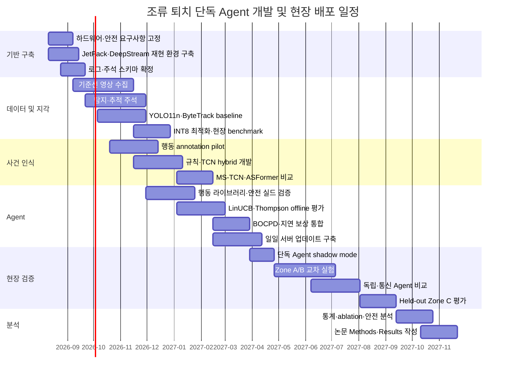

# Jetson Orin Nano 기반 조류 퇴치 AI 에이전트의 온디바이스·서버 협력형 구현 명세

## 실행 요약

본 시스템은 **통신이 끊겨도 독립적으로 조류를 탐지하고 안전한 퇴치 행동을 수행할 수 있는 온디바이스 에이전트**와, 하루 한 번 AP 접속 시 사건 로그를 집계해 정책을 갱신하는 **서버 측 학습 계층**으로 구성한다. 서버나 VLM·LLM은 실시간 LED·스피커 제어 경로에 포함하지 않으며, 모든 실시간 행동은 Jetson 내부의 인식 모듈, 사건 관리자, 정책 에이전트 및 독립 안전 실드가 결정한다.

권장 기본 스택은 다음과 같다.

| 계층 | 권장 기본 구성 | 대안 |
|---|---|---|
| 영상 파이프라인 | JetPack 7.2, DeepStream 9.1, TensorRT 10.16.2 | 검증된 기존 환경 유지 시 JetPack 6.2 계열 |
| 조류 탐지 | YOLO11n, 640 또는 960 입력, TensorRT FP16→INT8 | YOLOv8n, YOLOX-Tiny, RT-DETR-R18 |
| 추적 | ByteTrack | 빠른 비행에는 OC-SORT, 재식별이 중요하면 BoT-SORT |
| 행동·사건 인식 | 기하 규칙 + 경량 TCN/MS-TCN-lite | BiGRU, causal ASFormer-lite, MoViNet-A0 |
| 단독 에이전트 | Contextual Thompson Sampling + BOCPD | LinUCB, Discounted UCB |
| 행동 시퀀스 | 사전 검증된 Options 라이브러리 | 규칙 기반 escalation |
| 안전 | 정책 외부의 결정론적 safety shield + MCU 인터록 | 단일 Jetson 제어만 사용하는 구조는 비권장 |
| 서버 업데이트 | 사건 단위 로그의 일일 배치 업데이트 | 탐지·행동 모델은 주간 또는 필요 시 업데이트 |
| VLM·LLM | 불확실 사건 설명, 보고서, 디버깅에만 비동기 사용 | MobileCLIP을 로컬 의미 특징 추출기로 사용 |

Jetson Orin Nano Super는 최대 67 INT8 TOPS, 8GB LPDDR5, 102GB/s 메모리 대역폭과 7–25W 전력 모드를 제공한다. 현재 NVIDIA의 JetPack 7.2는 CUDA 13.2.1과 TensorRT 10.16.2를 포함하며, DeepStream 9.1은 Jetson Orin Nano를 공식 지원한다. 따라서 단일 카메라, 경량 탐지기, CPU 기반 추적기, 경량 시계열 모델을 동시에 운용할 수 있지만, 7B급 VLM을 실시간 인식 파이프라인과 상시 공존시키기에는 8GB 메모리가 부족하다. citeturn14view9turn14view10turn14view11

권장 데이터 흐름은 다음과 같다.

```text
Camera/GStreamer
    ↓
TensorRT bird detector
    ↓
ByteTrack or OC-SORT
    ↓
Track feature extraction
    ↓
Rule-based + temporal event model
    ↓
Incident manager and local memory
    ↓
Safety-action mask
    ↓
Contextual Thompson agent + BOCPD
    ↓
Prevalidated deterrence option
    ↓
Independent safety shield
    ↓
MCU lease/interlock
    ↓
LED / speaker actuation
    ↓
Response and delayed-return evaluation
    ↓
Local log → daily AP synchronization → server batch update
```

실시간 목표는 영상 획득부터 추적 결과 산출까지 40–80ms, 정책과 안전 판정까지 추가 10ms 이하로 설정한다. 다만 `approach`, `landing`, `feeding`, `leave`의 의미적 판정은 0.5–2초의 시간 창을 사용하므로, 영상 프레임 수준 지연과 행동 확정 지연을 구분하여 보고해야 한다.

## 시스템 아키텍처와 배포 기준

**온디바이스 실행 환경.** Jetson에는 DeepStream 기반 GStreamer 파이프라인을 배치하고, 카메라 디코딩·전처리·TensorRT 추론·객체 메타데이터 전달을 GPU 메모리 내에서 처리한다. NVIDIA는 DeepStream용 YOLOv8 및 YOLO11 파서와 TensorRT FP16·INT8 변환 예제를 제공하므로, 사용자 정의 Python 전처리보다 공식 DeepStream 파서를 우선한다. citeturn20view6turn20view7turn15search7

권장 프로세스 분리는 다음과 같다.

| 프로세스 | 기능 | 장애 시 동작 |
|---|---|---|
| `vision-service` | 카메라, 탐지, 추적, 특징 추출 | 에이전트에 `vision_unhealthy` 전달 |
| `event-service` | 행동 확률, 사건 상태기계, 단·장기 메모리 | 신규 자극 금지, 관찰 모드 |
| `policy-service` | 안전 행동 집합 내 행동 선택 | 마지막 검증 정책 또는 규칙 기반 fallback |
| `safety-service` | 사람·비표적·출력·시간·센서 제약 검사 | fail-closed |
| `actuator-mcu` | LED PWM, 음향 재생 허가, 과전류 차단 | lease 만료 시 즉시 OFF |
| `sync-service` | AP 탐색, 로그 업로드, 서명된 정책 다운로드 | 연결 실패 시 로컬 정책 지속 |
| `logger` | 사건·센서·자원·안전 로그 기록 | 로컬 순환 버퍼 유지 |

실시간 영상 경로는 C++ DeepStream 또는 DeepStream Python binding으로 구성할 수 있다. 초기 연구 프로토타입은 Python으로 충분하지만, 장기간 야외 운용에서는 GStreamer·TensorRT 경로를 C++로 고정하고 정책과 데이터베이스 계층만 Python 서비스로 분리하는 편이 메모리 누수와 프로세스 재시작 관리에 유리하다. NVIDIA는 탐지·추적·클라우드 메시지 전송 예제를 포함한 DeepStream Python 애플리케이션을 공개하고 있다. citeturn15search11

**실시간 경로와 비실시간 경로의 분리.**

```text
실시간 경로:
camera → detection → tracking → event → policy → safety → actuator

비실시간 경로:
selected frames/clips → VLM/LLM → explanation/debugging/report
daily logs → server learning → signed policy package → Jetson
```

VLM·LLM 응답, 서버 연결 또는 AP 가용성은 LED·스피커 실행의 필수 조건이 되어서는 안 된다. 통신 장애 시에도 마지막으로 검증된 정책, 안전 규칙, 행동 라이브러리로 독립 운용한다.

**권장 소프트웨어 고정 방식.** 운영 이미지에는 JetPack, DeepStream, TensorRT, CUDA, detector engine, event model, policy artifact, 안전 규칙의 버전과 SHA-256 해시를 기록한다. 새 모델은 `download → checksum → signature verification → shadow validation → atomic switch` 순서로 활성화하고, 오류 시 이전 버전으로 자동 롤백한다. TensorRT 성능은 `trtexec`로 배치 크기 1, 고정 전력 모드, 고정 클록 조건에서 측정해야 하며, 지연시간·처리량·GPU 메모리·열 스로틀링을 함께 기록한다. citeturn20view4

**정밀도 정책.** 최초 배포는 FP16으로 시작하고, 과수원 데이터로 정확도 저하를 확인한 뒤 INT8로 전환한다. INT8 PTQ에는 실제 과수원 조도·수관·비·안개·역광·작은 조류를 포함한 대표 calibration set이 필요하며, 작은 조류 재현율이 감소하면 QAT를 사용한다. TensorRT 문서는 PTQ가 대표 calibration data를 요구하며, QAT가 일반적으로 더 높은 정확도 회복을 제공한다고 설명한다. citeturn20view5

## 지각 및 사건 인식 모듈

**표 A. 후보 지각 모델 비교**

아래 Jetson 수치는 공개된 동일 조건 공식 벤치마크가 아니라, Orin Nano Super 25W, batch 1, TensorRT, 단일 1080p 카메라를 가정한 **설계 추정 범위**다. 최종 논문에는 실제 `trtexec` 및 end-to-end 측정값으로 대체한다.

| 유형·우선순위 | 모델 및 공식 구현 | 기본 입력 | 공개 정확도·특성 | Orin Nano 예상 성능 | 정량화·메모리 | 전처리·구현 메모 |
|---|---|---:|---|---|---|---|
| 탐지 1순위 | [YOLO11n](https://docs.ultralytics.com/ko/models/yolo11/) | 640×640; 작은 새가 많으면 960 | COCO mAP50–95 39.5, 2.6M parameters, 6.5B FLOPs; 공식 T4 TensorRT 지연 1.5ms citeturn14view1turn2search8 | FP16 25–40 FPS; INT8 35–55 FPS; detector 18–40ms | 추가 runtime 약 0.2–0.5GB; 전체 DeepStream 프로세스 약 1.0–1.8GB | letterbox, RGB, `/255`; DeepStream 공식 YOLO11 parser 사용. Ultralytics 라이선스는 AGPL 또는 상용 조건 검토 |
| 탐지 정확도형 | [YOLO11s](https://docs.ultralytics.com/ko/models/yolo11/) | 640×640 또는 960 | COCO mAP50–95 47.0, 9.4M parameters, 21.5B FLOPs citeturn14view1turn2search8 | FP16 14–24 FPS; INT8 20–32 FPS; 30–70ms | 약 0.4–0.9GB 증가 | 원거리 조류 recall이 YOLO11n보다 유의하게 향상될 때만 선택 |
| 안정적 대조모델 | [YOLOv8n](https://docs.ultralytics.com/models/yolov8/) | 640×640 | COCO 기반 사전학습, anchor-free 구조, TensorRT·DeepStream 지원; AGPL-3.0 또는 enterprise license citeturn14view2turn20view6 | FP16 23–38 FPS; INT8 30–50 FPS | 약 0.2–0.6GB 증가 | 기존 Jetson 사례와 도구가 많아 baseline에 적합 |
| 라이선스 친화형 | [YOLOX-Tiny](https://github.com/Megvii-BaseDetection/YOLOX) | 416×416 또는 640 | COCO AP 31.8의 공식 Tiny 모델; ONNX·TensorRT 지원, Apache-2.0 citeturn14view3turn2search14 | 416 FP16 30–50 FPS; 640 FP16 18–30 FPS | 약 0.2–0.5GB 증가 | 작은 조류에는 416보다 640 또는 ROI tiling 권장 |
| 정확도 대안 | [RT-DETR-R18](https://github.com/lyuwenyu/RT-DETR) | 640×640 | DETR 계열 end-to-end detector; 공식 R18 checkpoint와 TensorRT 배포 경로 제공 citeturn14view0turn2search18 | FP16 9–17 FPS; INT8 13–22 FPS | 약 0.8–1.5GB 증가 | NMS 의존성이 낮지만 8GB 장치에서는 YOLO11n보다 무거움 |
| 추적 1순위 | [ByteTrack](https://github.com/FoundationVision/ByteTrack) | detector boxes | MOT17에서 80.3 MOTA, 77.3 IDF1, 63.1 HOTA, V100 29.6 FPS citeturn14view4 | detector 이후 CPU 1–5ms/frame | 보통 50–150MB | 고정 카메라·수관 가림에서 낮은 score box까지 연계하는 장점 |
| 빠른 비행 대안 | [OC-SORT](https://github.com/noahcao/OC_SORT) | detector boxes | 비선형 움직임과 가림을 관측 중심으로 보정하며 논문 구현은 CPU 700 FPS 이상을 보고 citeturn5search18 | 약 1–3ms/frame | 50–120MB | 급격한 방향 전환이 많은 비행 조류에 우선 실험 |
| 재식별 대안 | [BoT-SORT](https://github.com/NirAharon/BoT-SORT) | boxes + appearance | MOT17에서 80.5 MOTA, 80.2 IDF1, 65.0 HOTA가 보고됨 citeturn14view6turn5search9 | ReID 포함 5–15ms/frame | 0.2–0.6GB | 유사한 새가 교차하는 경우 유리하나 8GB 장치에서는 선택적 사용 |
| 행동 1순위 | Track-feature TCN | 5–10Hz, 32–64 step | bbox·속도·가속도·구역 거리·정지시간을 입력하는 자체 경량 모델 | 1–5ms/window, 200Hz 이상 가능 | 20–100MB | 접근·이탈은 영상 crop 없이 처리; 가장 재현성과 해석성이 높음 |
| 행동 보완 | MobileNetV3-Small + BiGRU | bird crop 224×224, 8–16 frames | 경량 spatial embedding과 시계열 분류 | 15–40ms/clip | 0.3–0.7GB | feeding/pecking처럼 외형 단서가 필요한 사건에만 실행 |
| 비디오 대안 | [TSM-MobileNetV2](https://github.com/mit-han-lab/temporal-shift-module) | 224×224, 8 frames | TSM은 추가 convolution이나 parameter 없이 채널 일부를 시간축으로 이동시켜 온라인 인식을 지원한다. citeturn7search9 | 35–90ms/clip | 0.4–0.9GB | crop 기반 동작 분류의 경량 대조모델 |
| 스트리밍 대안 | [MoViNet-A0-Stream](https://github.com/tensorflow/models/tree/master/official/projects/movinet) | 약 172–224, 스트리밍 frame | stream buffer로 긴 영상에서도 메모리를 일정하게 유지하도록 설계됨 citeturn15search2turn15search10 | 60–160ms/window | 0.5–1.2GB | TensorFlow→ONNX/TensorRT 변환 검증 필요 |
| 정확도 대안 | [X3D-XS](https://github.com/facebookresearch/SlowFast) | 160–224, 4–16 frames | 효율적인 3D CNN 계열 공식 구현 citeturn7search14turn7search2 | 100–250ms/clip | 0.8–1.8GB | 상시 실행보다 어려운 사건의 second-stage classifier에 적합 |

탐지기는 COCO 사전학습만으로 최종 성능을 주장해서는 안 된다. AirBirds 데이터셋은 118,312장의 연속 영상 이미지와 409,967개의 비행 조류 box를 포함하며, 평균 조류 크기가 1920×1080 영상에서 10픽셀 미만이어서 일반 detector가 작은 비행 조류에 취약함을 보여준다. SOD4SB는 39,070장과 137,121개 조류 instance를 제공하고, FBD-SV-2024는 483개 감시영상 클립, 28,694 frame, 28,366개 비행 조류 instance를 제공한다. citeturn18view2turn19search1turn18view3

따라서 학습 순서는 `COCO pretrained → 공개 조류 데이터 pre-finetuning → 과수원 데이터 final fine-tuning`으로 구성한다. 종 분류까지 필요하면 1,433종과 148,000개 수동 주석 이미지를 포함하는 GBDD-1433-2023을 활용할 수 있지만, 과수원에서는 우선 `target bird / non-target bird / uncertain`의 운영 분류가 더 안정적이다. citeturn19search0turn19search4

**영상 해상도 정책.** 640 입력에서 조류가 지나치게 작아지는 경우 모델을 키우기보다 먼저 렌즈 초점거리·카메라 위치·ROI를 조정한다. 권장 구조는 1080p 영상을 유지하면서 640 또는 960 full-frame detector를 15–25 FPS로 실행하고, 조류 후보가 발생한 구역만 원본 해상도에서 crop해 행동 분류기로 전달하는 것이다. 2×2 tiling은 작은 새 검출에는 유리하지만 연산량과 중복 box가 증가하므로 5–10 FPS 보조 탐지에만 사용한다.

**표 B. 사건 분할 모델 비교**

| 방법 | 권장 용도와 구조 | 주요 hyperparameter | 필요한 주석 | 평가 지표 | 예상 edge 비용 |
|---|---|---|---|---|---|
| 규칙 기반 상태기계 | approach·leave의 1차 판정. 구역 polygon, signed distance, 속도, 정지시간을 사용 | outer/inner zone, 최소 지속시간 0.5–2s, velocity EWMA, hysteresis | zone, track, 사건 시작·종료 일부 | event precision/recall, onset delay, false transition/min | <1ms, <20MB |
| 규칙 + HMM/CRF | 짧은 오인식 제거 및 허용 전이 강제. `approach→landing/perching→feeding→leave` 순서 반영 | transition prior, emission temperature, minimum duration | frame별 행동 또는 약한 사건 구간 | frame F1, segment F1, edit score | <2ms |
| BiGRU/BiLSTM | 데이터가 적고 feature dimension이 작은 초기 학습 | 1–2 layer, hidden 64–128, sequence 32–64, dropout 0.2–0.4 | 5–10Hz frame label | macro-F1, class recall, boundary F1 | 2–10ms; Bi-directional은 고정 지연 필요 |
| Causal TCN | **권장 기본 학습모델**. dilated convolution으로 긴 맥락을 낮은 비용에 처리 | 4–8 layer, channels 32–64, kernel 3, dilation 1–64, receptive field 3–12s | frame label + boundary | F1@10/25/50, edit, frame accuracy, onset latency | 1–5ms |
| MS-TCN-lite | 초기 예측을 여러 stage에서 정제해 over-segmentation 감소 | 2–3 stages, stage당 6–8 layer, 64 channels, classification+smoothing loss | dense frame labels | F1@10/25/50, edit, frame accuracy | 3–12ms | 
| ASFormer-lite | 장기 의존성과 불규칙한 행동 전이를 모델링하는 정확도 대안 | 2 encoder/2 decoder, d=64, 4 heads, local window 32–64 | dense frame labels | F1@10/25/50, edit, boundary F1 | 8–25ms |
| MoViNet/TSM crop classifier | landing·feeding이 기하 특징만으로 구분되지 않을 때 second stage로 사용 | 8–16 crop frames, 4–8 FPS sampling | bird crop과 clip label 또는 frame label | macro-F1, feeding sensitivity, calibration ECE | 35–160ms/event |
| 권장 hybrid | 기하 규칙으로 approach/leave, TCN으로 landing/perching, crop classifier로 feeding을 확인 | 위 모델의 조합 | track·zone·행동·crop label | event F1, latency, feeding recall | 평균 5–20ms; crop model은 event-triggered |

MS-TCN은 dilated temporal convolution을 여러 stage로 정제하고 classification loss와 smoothing loss를 결합해 과도한 구간 분할을 줄이도록 설계되었다. ASFormer는 temporal action segmentation에 transformer attention을 적용한다. 원형 모델들은 전체 sequence를 사용하는 경우가 있으므로 실시간 장치에서는 causal convolution 또는 최근 3–10초 sliding window로 변환해야 한다. citeturn15search0turn15search4turn14view7turn6search6turn14view8

**권장 사건 정의.**

| 사건 | 운영 정의 | 자동 판정 근거 |
|---|---|---|
| `approach` | 외곽 구역에서 대상 수관·과실 구역으로 순거리 감소가 지속됨 | zone signed distance 감소, inward velocity, 1초 이상 지속 |
| `landing` | 비행 상태에서 수관·지면 위치에 접촉하고 저속 상태가 유지됨 | 속도 급감, box 안정화, 수관 contact zone, 0.5초 이상 |
| `perching` | 수관에 정지했으나 섭식 증거가 없음 | 낮은 속도, 위치 유지, feeding probability 낮음 |
| `feeding_suspected` | 머리·부리의 반복 움직임 또는 과실과의 근접 상호작용 | crop classifier, 반복 optical motion, fruit ROI 거리 |
| `feeding_confirmed` | 2명 주석자 또는 고신뢰 모델이 섭식 행동을 확인 | 고신뢰 crop 분류 또는 수동 검증 |
| `leave_tree` | 대상 나무에서 이탈 | tree polygon exit |
| `leave_zone` | 실험 구역을 완전히 이탈 | outer polygon exit |
| `return` | 이전 이탈 후 동일 종·track cluster가 재진입 | 시간 창 및 진입 방향 기반 사건 연결 |
| `unknown/occluded` | 가림·해상도 부족으로 상태 확정 불가 | visibility·confidence 기준 미달 |

Visual WetlandBirds는 178개 영상, 13종, 7개 행동 범주와 frame 수준의 공간·시간 행동 주석을 제공하므로 비디오 행동 모델의 사전학습 또는 annotation schema 참고에 유용하다. 그러나 습지 조류 행동과 과수원 섭식 행동의 도메인이 다르므로, 공개 데이터의 정확도를 과수원 성능으로 직접 인용해서는 안 된다. citeturn19search2turn19search6turn19search7turn18view5

## 에이전트 정책과 일일 서버 업데이트

단독 에이전트의 기본 정책은 **contextual Thompson sampling과 Bayesian online change-point detection을 결합한 비정상성 contextual bandit**으로 구현하는 것이 가장 현실적이다. 초기 현장 데이터가 적고 행동 직후 이탈·섭식 중단이라는 빠른 보상이 관측되는 반면, 완전한 POMDP 강화학습은 잠재 적응 상태와 지연 재접근 보상 때문에 훨씬 많은 자료를 요구하기 때문이다. LinUCB와 contextual Thompson sampling은 문맥에 따른 행동 효용과 탐색 불확실성을 계산할 수 있고, BOCPD는 시간에 따라 자극 반응 분포가 변하는 시점을 확률적으로 추정한다. citeturn18view10turn18view11turn18view12

**표 C. 정책 알고리즘 비교**

| 정책군 | 구체적 알고리즘 | 장점 | 한계 | 본 연구 권장 용도 |
|---|---|---|---|---|
| 선형 contextual bandit | LinUCB | 계산이 단순하고 행동 선택 근거가 명확함; CPU에서 <1ms | 선형 보상 가정, 비정상 적응에 별도 조치 필요 | 첫 현장 pilot 및 baseline |
| 베이지안 contextual bandit | Linear contextual Thompson sampling | uncertainty 기반 탐색, 적은 자료에서 자연스러운 posterior update | prior·noise scale에 민감 | **단독 Agent 기본 정책** |
| 비정상 bandit | Discounted TS/UCB, sliding-window TS | 오래된 경험의 영향 감소 | 할인율 선택 필요 | 계절·일별 변화 대응 |
| 변화점 결합 | Thompson sampling + BOCPD | 성공률·이탈시간의 급격한 저하를 적응 후보로 탐지 | 짧은 노이즈를 적응으로 오인할 가능성 | **자극별 habituation 감시** |
| 계층형 정책 | Options/HRL | 안전 검증된 행동 시퀀스를 하나의 option으로 선택 가능 | option 설계 필요 | `audio→observe→LED`와 같은 순차 퇴치 |
| 잠재상태 강화학습 | belief encoder + PPO | 장기 재접근과 부분관측 적응을 직접 최적화 가능 | 데이터·시뮬레이터 요구량이 큼, 안정성 검증 어려움 | 충분한 field episode 축적 후 |
| Bayesian RL/POMDP | particle belief + model-based planning | 적응 상태의 불확실성을 명시적으로 관리 | 구현 복잡도와 계산비용이 큼 | 후속 연구 또는 서버 시뮬레이션 |
| 규칙 정책 | fixed escalation | 해석성과 재현성이 높음 | 종·상황·반응에 적응하지 못함 | 안전 fallback 및 비교군 |

PPO는 정책 업데이트가 비교적 안정적인 범용 강화학습 알고리즘이며, options framework는 시작 조건·내부 정책·종료 조건으로 구성된 temporally extended action을 정의한다. 본 연구에서는 PPO가 LED·스피커를 직접 제어하는 대신, 사전 안전 검증된 option 중 하나를 선택하도록 제한하는 것이 적절하다. citeturn18view14turn8search3

**상태 표현.**

\[
s_t=[
e_{\text{species}},
n_{\text{birds}},
p_{\text{behavior}},
z_{\text{zone}},
v,\,
t_{\text{day}},
L_{\text{ambient}},
N_{\text{background}},
h_{\text{recent actions}},
q_{\text{response}},
b_{\text{habituation}},
r_{\text{resource}},
m_{\text{safety}}
]
\]

여기서 \(e_{\text{species}}\)는 종 또는 종군 embedding, \(p_{\text{behavior}}\)는 접근·착지·섭식·이탈 확률, \(h_{\text{recent actions}}\)는 최근 자극 종류와 반복 횟수, \(q_{\text{response}}\)는 최근 성공률·이탈시간·재접근시간의 이동통계, \(b_{\text{habituation}}\)는 자극별 적응 상태 posterior다. 초기 모델에서는 20–50차원의 정규화된 feature vector로 제한한다.

**행동 표현.** 연속 파라미터를 직접 생성하지 않고 검증된 12–24개 discrete arm을 정의한다.

\[
a_t=(\text{modality},\text{pattern},\text{intensity},
\text{duration},\text{observation window})
\]

예를 들면 `OBSERVE`, `AUDIO_A_LOW_2S`, `AUDIO_B_MED_3S`, `LED_IRREGULAR_LOW_2S`, `LED_PATTERN_B_MED_2S`, `AUDIO_THEN_LED`, `LED_THEN_AUDIO`, `COOLDOWN`으로 구성한다. LED 점멸주파수, 최대 duty cycle, 음압, 1회 지속시간은 agent의 자유 출력이 아니라 사전에 검증된 whitelist에 고정한다.

**보상 설계.**

\[
\begin{aligned}
R_t={}&
w_1 I_{\text{feeding stop}}
+w_2 I_{\text{tree leave}}
+w_3 I_{\text{zone leave}}\\
&+w_4\log(1+T_{\text{return}})
-w_5T_{\text{escape}}\\
&-w_6C_{\text{energy}}
-w_7C_{\text{noise}}
-w_8C_{\text{non-target}}\\
&-w_9C_{\text{repetition}}
-w_{10}C_{\text{habituation}}
-w_{11}C_{\text{false activation}} .
\end{aligned}
\]

권장 초기 정규화 예시는 `feeding stop=0.2`, `tree leave=0.4`, `zone leave=1.0`, `return delay=0–1.0`, `energy/noise=0–0.2`, `non-target=1.0`, `false activation=0.5`다. 안전 위반 행동은 큰 음의 보상을 주어 학습시키는 방식이 아니라 **사전에 action mask로 제거**한다.

자극 \(a\)의 적응 패널티는 다음처럼 계산할 수 있다.

\[
C_{\text{habituation}}(a,t)=
\lambda_1 P(\text{change point at }t)
+\lambda_2 \max(0,-\hat{\beta}_{\text{success},a})
+\lambda_3 F_{\text{recent use},a},
\]

여기서 변화점 posterior가 높거나 최근 성공률 기울기가 하락하고 동일 자극 사용 빈도가 높을수록 행동 효용을 낮춘다. 단순 방문 빈도의 변곡점은 먹이량·날씨·종 구성 변화에 의해 발생할 수 있으므로 적응 판정의 단독 기준으로 사용하지 않는다.

**온디바이스 반복 루프.**

```text
while system is healthy:
    detections = detector(frame)
    tracks = tracker(detections)
    event_state = event_manager.update(tracks, crop_features)

    if event_state.requires_deterrence:
        context = build_context(event_state, memory, sensors)
        safe_actions = safety_shield.mask(action_library, context)

        if safe_actions is empty:
            log("no_safe_action")
            continue

        action, propensity = policy.sample(context, safe_actions)
        permit = safety_shield.final_check(action, current_sensors)

        if permit:
            actuator.execute_with_lease(action)
            response = observe_response()
            immediate_reward = score_response(response)
            policy.local_update(context, action, immediate_reward)
            memory.store_pending_delayed_reward(event_id)

    if return_event_resolved:
        delayed_reward = score_return_time()
        policy.update_delayed_reward(event_id, delayed_reward)
```

행동 선택 확률 또는 propensity를 반드시 로그에 저장해야 무작위·규칙·에이전트 정책의 off-policy 비교가 가능하다.

**일일 서버 업데이트 절차.**

| 단계 | 서버 작업 | Jetson에 미치는 영향 |
|---|---|---|
| 업로드 준비 | 사건 단위 Parquet/JSONL, 센서 요약, 모델 상태, 선택 frame을 zstd로 압축 | 실시간 처리와 분리된 낮은 우선순위 프로세스 |
| 데이터 검증 | schema, timestamp, 중복 event, action propensity, delayed reward 연결 확인 | 오류 사건은 quarantine |
| 품질·drift 분석 | 종·행동 분포, confidence, 탐지율, feature drift, 센서 이상 분석 | drift가 커도 자동 detector 교체 금지 |
| 정책 업데이트 | TS posterior, 할인 통계, BOCPD posterior, action effectiveness 갱신 | 수 kB–수 MB 정책 artifact 생성 |
| offline evaluation | holdout replay, safety-mask compliance, reward lower bound, action distribution 비교 | 기존 정책보다 기준 미달 시 배포 안 함 |
| 패키지 서명 | version, schema, expiry, minimum software version, SHA-256, Ed25519 signature | 서명 실패 시 거부 |
| 다운로드·검증 | AP 연결 시 임시 위치에 다운로드 후 shadow test | 기존 정책 계속 운용 |
| atomic activation | 사건이 진행 중이지 않을 때 정책 교체 | 실패 시 last-known-good로 rollback |

**통신 예산.** 기본 업로드는 원시 영상을 제외하고 사건 메타데이터, trajectory, 센서, 행동, 결과를 포함해 장치당 하루 1–20MB를 목표로 한다. 불확실 사건과 실패 사건만 JPEG 1–3장 또는 3–5초 H.265 clip으로 추가하며, 일일 미디어 상한을 50–200MB로 설정한다. 정책 posterior와 행동 통계는 대개 수 MB 미만이므로 매일 갱신할 수 있지만, detector와 행동 모델 TensorRT engine은 수십 MB 이상일 수 있어 주간 또는 명시적 승인 시에만 배포한다.

원본 영상에는 작업자가 포함될 수 있으므로 기본 서버 업로드 대상에서 제외하고, 필요한 경우 사람 영역을 edge에서 마스킹한다. 클라우드 API를 사용하는 경우에도 전체 영상 대신 crop·구조화된 사건 정보만 전송한다.

## VLM·LLM 보조 계층

VLM·LLM은 실시간 조류 탐지기나 actuator controller로 사용하지 않는다. 적합한 용도는 불확실한 장면의 의미 검색, 안전 상황 설명, 정책 실패 원인 분석, 사건 보고서 생성 및 연구자용 질의 인터페이스다.

**표 D. VLM·LLM 선택지 비교**

| 구성 | 적합한 역할 | Orin Nano/네트워크 지연 | 메모리·비용 | 개인정보·오프라인 | 권고 |
|---|---|---|---|---|---|
| [MobileCLIP-S0](https://github.com/apple/ml-mobileclip) | crop embedding, 텍스트-영상 유사도, “사람/차량/새/과실” 의미 검색 | 본 연구 추정 10–40ms/image | 약 0.2–0.6GB, 호출비 없음 | 완전 로컬 | **상시 사용 가능한 의미 feature extractor** |
| [BLIP-2](https://arxiv.org/abs/2301.12597) | image caption, 질의응답 | backbone·LLM에 따라 수초 이상 | 일반적으로 8GB 장치에 부담 | 로컬 가능하나 detector와 동시 상시 운용 비권장 | 서버 또는 개발 단계 |
| [MiniGPT-4 7B](https://github.com/Vision-CAIR/MiniGPT-4) | 장면 설명·복합 질의 | 수초–수십초 | 공식 구현은 8-bit 7B도 약 11.5GB GPU 메모리를 요구 citeturn18view8 | 8GB Orin Nano 단독 상시 실행 불가 | 비권장 |
| Gemma 3 4B local VLM | 사건 keyframe 설명 | Jetson AI Lab 사례에서 Orin Nano 약 7–8초/frame citeturn18view9 | 4-bit 사용 시에도 상당한 메모리 점유 | 오프라인 가능 | 야간 batch 또는 수동 디버깅 |
| OpenAI vision-capable API | 안전 요약, incident report, 복합 장면 분석 | AP·인터넷 상태에 따라 비동기 수초 이상 | 이미지도 토큰화되며 모델별 단가가 다름; [공식 가격표](https://openai.com/api/pricing/) 기준으로 일일 호출 상한 설정 citeturn17search0turn11search4 | API 데이터는 기본적으로 학습에 사용되지 않지만 abuse log가 기본 최대 30일 보관될 수 있고 승인 고객은 ZDR을 신청할 수 있음 citeturn20view3turn17search16 | 하루 사건 요약·실패 분석 |
| Claude Haiku/Sonnet API | 긴 incident log 분석, 정책 디버깅, 설명 생성 | 네트워크 의존 비동기 처리 | Haiku 4.5는 1M input/output token당 $1/$5; Sonnet 5는 2026-08-31까지 $2/$10, 이후 $3/$15로 공지됨 citeturn17search2turn20view2 | 계약·보존·리전 조건을 별도 검토 | 서버 분석 대안 |
| Hybrid harness | edge에서 MobileCLIP·rule로 사건 선별 후 cloud VLM 호출 | 실시간 제어와 분리 | 호출량 90% 이상 감소 가능하도록 threshold 설계 | 연결 없으면 구조화된 로컬 보고서 사용 | **최종 권장 구조** |

MobileCLIP-S0는 OpenAI CLIP ViT-B/16과 유사한 zero-shot 성능을 유지하면서 공식 보고상 4.8배 빠르고 2.8배 작아, 생성형 VLM 대신 장면 embedding과 검색 용도로 적합하다. citeturn18view6

**VLM 호출 조건.** 다음 조건 중 하나를 만족할 때만 서버 큐에 사건을 추가한다.

```text
behavior_confidence < threshold
OR target_species_confidence < threshold
OR non_target_risk = true
OR policy_failure_after_max_actions = true
OR safety_mask_changed_during_action = true
OR researcher_requested_review = true
```

VLM 응답은 `advisory_only=true`로 저장하며, 당일 실시간 행동을 직접 변경하지 않는다. 정책 반영은 연구자 검토 또는 다음 일일 서버 업데이트의 검증 절차를 거친다.

**안전 결정 요약 프롬프트.**

```text
역할:
당신은 농업용 조류 퇴치 시스템의 사후 안전 분석기이다.
LED 또는 스피커를 직접 작동시키거나 안전 규칙을 수정하지 않는다.

입력:
- 사건 메타데이터: {event_json}
- 감지된 객체와 신뢰도: {objects}
- 적용된 안전 마스크: {safety_mask}
- 선택 행동과 실제 출력: {action_log}
- 센서 상태: {sensor_health}

작업:
1. 위험요인을 사람, 차량, 비표적 동물, 과도한 음향,
   LED 노출, 센서 오류로 나누어 요약한다.
2. 안전 실드의 허용 또는 차단 결정이 입력 규칙과 일치했는지 평가한다.
3. 정보가 부족하면 추정하지 말고 "판정 불가"로 표시한다.

출력 JSON:
{
  "risk_level": "low|medium|high|undetermined",
  "detected_risks": [],
  "shield_decision_consistent": true,
  "missing_information": [],
  "review_required": false,
  "summary_ko": ""
}
```

**고수준 행동 제안 프롬프트.**

```text
역할:
당신은 퇴치 정책 디버깅을 지원하는 자문 모델이다.
허용 행동 집합 밖의 행동을 제안할 수 없으며,
현재 사건의 액추에이터를 직접 제어하지 않는다.

입력:
- 조류 종/종군과 행동 확률: {bird_state}
- 최근 자극 이력과 반응: {history}
- 자극별 적응 posterior: {habituation}
- 허용된 행동: {safe_actions}
- 전력·소음 예산: {resource_budget}

작업:
허용된 행동 중 최대 3개 후보를 우선순위로 제안한다.
각 후보에 예상 효과, 적응 위험, 에너지·소음 비용,
실패 시 종료 또는 전환 조건을 설명한다.

출력 JSON:
{
  "recommendations": [
    {
      "action_id": "",
      "rationale_ko": "",
      "expected_effect": "low|medium|high",
      "habituation_risk": "low|medium|high",
      "termination_condition": ""
    }
  ],
  "uncertainty": "",
  "human_review_note": ""
}
```

**사건 보고서 프롬프트.**

```text
역할:
당신은 조류 퇴치 현장실험의 연구 기록 작성자이다.

입력:
- 사건 시간선: {timeline}
- 탐지/추적/행동 결과: {perception}
- 선택 행동과 propensity: {policy}
- 안전 판정: {safety}
- 즉시 반응과 재접근 결과: {outcome}
- 에너지, 음압, LED 작동량: {resources}

작업:
객관적인 사실과 모델의 추정을 분리하여
한국어 사건 보고서를 작성한다.
과장된 인과 표현을 사용하지 않는다.

출력:
- 사건 요약
- 조류 행동 전이
- 수행한 자극 시퀀스
- 즉시 및 지연 반응
- 안전·자원 사용
- 불확실성
- 학습 데이터 포함 권고
```

## 안전·데이터·검증 설계

**안전 실드.** 안전 실드는 에이전트가 행동을 고른 뒤 검사하는 단일 함수가 아니라, 행동 전·실행 중·실행 후에 반복되는 독립 모듈로 구성한다.

\[
A_{\text{safe},t}
=
\{a\in A\mid
g_k(s_t,a)\le0,\ \forall k\}.
\]

CBF를 구현하지 않아도 다음 결정론적 검사를 적용할 수 있다.

| 안전 조건 | 검사 방식 | 위반 시 처리 |
|---|---|---|
| 사람·작업자 존재 | person detector + 작업영역 polygon + 최근 N frame persistence | 스피커 제한 또는 mute, LED 차단, MCU lease 회수 |
| 도로·주거지·인접 구역 LED 노출 | 카메라 calibration과 고정 금지 polygon, LED 방향·시야각 검사 | 해당 LED action 제거 |
| 비표적·보호 대상 | species/target confidence와 non-target whitelist | 적극적 자극 차단 또는 저강도 관찰 |
| 과도한 음압 | 출력 단계별 사전 측정 SPL map, microphone feedback, 누적 noise dose | gain 제한, audio cooldown |
| 점멸 안전 | 승인된 주파수·duty cycle·지속시간 whitelist | 임의 파라미터 거부 |
| 과도한 반복 | modality별 최대 연속 횟수와 cooldown | 다른 감각 또는 관찰 행동만 허용 |
| 카메라·추적 오류 | FPS, timestamp, frozen frame hash, confidence, calibration checksum | 신규 행동 차단 |
| 전력·온도 이상 | 전압·전류·Jetson 온도·MCU 온도 | 단계적 출력 제한 후 차단 |
| 정책 또는 모델 손상 | signature, hash, schema, expiry | last-known-good 유지 |
| 통신 장애 | AP 연결 및 서버 heartbeat | 실시간 제어 영향 없음; 동기화만 연기 |

음향 안전은 최소한 작업자 위치에서 `LAeq`, `Lmax`, 누적 노출시간을 기록해야 한다. NIOSH는 직업성 소음의 권고 노출 한계를 8시간 평균 85dBA로 제시하며, 3dB 증가 시 허용 노출시간을 줄이는 원칙을 사용한다. 이 수치는 조류 퇴치 효과 기준이 아니라 작업자 청력 보호를 위한 상한 참고치이며, 국내 법규와 현장 안전관리 기준을 별도로 적용해야 한다. citeturn16search3turn16search6turn16search8

**MCU 기반 fail-closed 인터록.** Jetson이 GPIO를 직접 계속 유지하는 방식보다 독립 MCU가 출력 enable을 소유하도록 한다. Jetson은 100–250ms마다 제한시간이 있는 permit lease를 갱신하고, 500ms 이상 heartbeat가 없거나 Jetson 재부팅·프로세스 정지·통신 오류가 발생하면 MCU가 LED와 앰프 enable을 제거한다. 물리적 비상정지와 수동 maintenance mode는 AI 경로보다 높은 우선순위를 갖는다.

**안전 검증 시험.**

| 시험 사례 | 자극 조건 | 합격 기준 |
|---|---|---|
| 실행 전 작업자 진입 | LED·음향 후보 선택 직전 사람이 금지구역 진입 | 행동 100% 차단 |
| 실행 중 작업자 진입 | 음향 또는 LED 실행 중 사람 진입 | 설정된 shutdown deadline 내 출력 OFF |
| camera freeze | 동일 frame·timestamp 지속 | 신규 lease 중단, actuator OFF |
| detector process crash | vision service 종료 | watchdog 재시작, 그동안 자극 없음 |
| 과전류·과열 | 전류 제한 또는 온도 임계 초과 주입 | 해당 modality 차단 |
| microphone failure | SPL feedback 없음 | 보수적 gain 제한 또는 audio 금지 |
| 잘못된 정책 서명 | 임의 수정 artifact 배포 | 활성화 거부 |
| AP 단절 | 다운로드 중 통신 해제 | 기존 정책 손상 없이 계속 동작 |
| 안전 행동 없음 | 모든 modality가 mask됨 | 관찰·로그만 수행 |
| 비표적 오탐 | 비표적 영상을 target으로 오분류하도록 입력 | non-target 확인 단계 또는 저강도 fallback |
| 장시간 반복 | 동일 행동 연속 요청 | cooldown·누적 예산으로 차단 |

각 시험은 최소 30–100회 반복하고, 차단 성공률, 평균·95백분위·최대 차단 지연, 잘못된 차단률, 출력 잔류시간을 기록한다.

**주석 스키마.**

```json
{
  "video_id": "A_20260912_093200",
  "camera_id": "A_CAM01",
  "zone_id": "A",
  "track_id": 142,
  "species_label": "magpie",
  "species_confidence": 0.93,
  "target_status": "target|non_target|unknown",
  "frame_start": 1030,
  "frame_end": 1125,
  "event_label": "approach|landing|perching|feeding_suspected|feeding_confirmed|leave_tree|leave_zone|unknown",
  "bbox_xyxy": [],
  "visibility": "full|partial|occluded",
  "behavior_confidence": 3,
  "stimulus_active": false,
  "stimulus_id": null,
  "stimulus_evoked_transition": "yes|no|uncertain",
  "annotator_id": "R01",
  "review_status": "single|double|adjudicated"
}
```

행동 구간은 원본 25–30 FPS에서 주석하되 학습용 frame label은 5–10Hz로 변환할 수 있다. 사건 시작·종료는 ±0.2–0.5초 허용오차를 정의하며, `feeding_confirmed`와 안전 관련 표본은 두 명이 독립 주석하고 불일치를 제3자가 조정한다. 주석 일치도는 event별 Cohen’s κ 또는 Krippendorff’s α와 boundary disagreement를 보고한다.

**데이터 규모 권장치.** 다음 수치는 보편적인 통계 법칙이 아니라 본 장치의 실용적 시작점이다.

| 목적 | 최소 pilot | 권장 논문 규모 |
|---|---:|---:|
| target bird detector | 과수원 이미지 2,000–5,000장, 5,000개 이상 box | 10,000장 이상, 계절·시간·날씨 균형 |
| approach/leave | event별 200–300건 | event별 500–1,000건 |
| landing/perching | 종군별 200건 | 종군별 500건 이상 |
| feeding | 확인된 feeding 300건 이상 | 500–1,000건 및 hard negative 동일 규모 |
| agent 학습 | action당 최소 30–50회의 초기 탐색 | 주요 상태×행동 조합당 100회 이상 |
| 적응 분석 | 처치별 최소 수백 exposure | 여러 주·여러 period의 수천 event |

종별 자료가 부족하면 `까치류`, `소형 참새류`, `중형 과식성 조류`와 같은 생태·행동 종군 모델을 먼저 학습하고, 충분한 종만 종별 parameter를 추정한다.

**증강.** 탐지는 scale jitter, random crop, motion blur, defocus blur, 비·안개·역광, exposure shift, JPEG artifact, 작은 조류 copy-paste를 사용한다. Mosaic와 MixUp은 작은 객체 수를 늘리는 데 유용하지만 실제 과수원 배경 분포를 왜곡할 수 있으므로 마지막 fine-tuning epoch에서는 비활성화한다. 행동 모델에는 temporal crop, speed jitter, frame drop, 짧은 occlusion, 시작·종료 boundary jitter를 적용한다. 구역 방향이 행동 의미에 포함되면 좌우 반전을 적용한 뒤 zone coordinate와 velocity도 함께 변환해야 한다.

**데이터 분할.** 같은 영상의 인접 frame을 train과 test로 나누지 않는다. `day × camera × visit session` 단위 GroupKFold를 사용하고, 종·조도·날씨를 층화한다. Zone C는 정책·threshold·hyperparameter·INT8 calibration에 사용하지 않고, 최종 모델과 정책을 동결한 뒤 한 번만 평가한다. 이 결과는 “동일 과수원 내 held-out zone 전이”로 표현하며, 다른 농장 일반화로 확대 해석하지 않는다.

## 구현·평가 및 개발 일정

**권장 자원 예산.**

| 모듈 | GPU/CPU | 메모리 추정 | 지연 예산 | 실행률 |
|---|---|---:|---:|---:|
| 카메라 decode·resize | NVDEC/GPU | 0.2–0.5GB | 5–12ms | 20–30 FPS |
| YOLO11n FP16/INT8 | GPU | 0.2–0.5GB 추가 | 18–40ms | 20–40 FPS |
| ByteTrack/OC-SORT | CPU | 0.05–0.15GB | 1–5ms | 매 detector frame |
| track feature extraction | CPU/GPU | <0.1GB | 1–3ms | 5–20Hz |
| causal TCN/MS-TCN-lite | GPU 또는 CPU | 0.05–0.2GB | 1–12ms | 5–10Hz |
| crop behavior classifier | GPU | 0.3–1.0GB | 20–160ms | 후보 사건에만 |
| policy + BOCPD | CPU | <0.1GB | <5ms | 사건 발생 시 |
| safety shield | CPU/MCU | <0.05GB | <2ms | 행동 전·실행 중 |
| logger·SQLite/Parquet | CPU/NVMe | 0.1–0.3GB | 비동기 | 지속 |
| 전체 권장 | GPU 50–85%, CPU 2–4 core | 약 5.0–7.0GB 포함 OS/cache | 영상 결과 40–80ms | 15–25 FPS |

Jetson은 15–25W 모드로 운영하고, 현장 온도에서 열 스로틀링이 발생하지 않는지 확인한다. 논문에는 평균 전력뿐 아니라 95백분위 전력, GPU·CPU 온도, 클록 감소 시간, 성공 퇴치 1건당 Wh를 보고한다. Orin Nano의 공식 전력 범위는 7–25W다. citeturn14view9

**로그 스키마.**

| 그룹 | 필드 |
|---|---|
| 식별 | device_id, zone_id, camera_id, event_id, track_id |
| 시간 | UTC timestamp, local timestamp, frame PTS, event start/end |
| 버전 | detector/event/policy/safety version, TensorRT engine hash |
| 인식 | bbox, detector score, species probabilities, behavior probabilities, visibility |
| 궤적 | centroid, velocity, acceleration, zone distances |
| 정책 | context vector hash, candidate actions, safety mask, selected action, propensity, posterior sample |
| 자극 | modality, pattern, intensity level, duration, actual start/end |
| 자원 | voltage, current, Wh, SPL estimate, microphone LAeq/Lmax, LED duty, ambient lux |
| 반응 | alert, feeding_stop, tree_leave, zone_leave, escape_time, return_time |
| 안전 | person/non-target flags, blocked action, interlock reason, shutdown latency |
| 상태 | camera FPS, dropped frames, GPU load, memory, temperature, AP connectivity |
| 검토 | human label, VLM advisory, disagreement, inclusion status |

**일일 서버 전송 지표.**

```text
event count by species/behavior/zone
detection and tracking confidence distributions
action counts and propensities
success rate and feeding-stop rate
escape-time quantiles
return-time quantiles and censored events
reward distribution
action-specific EWMA success
BOCPD change-point posterior
same-action repetition rate
energy per event and per success
audio duration and estimated worker noise dose
LED duty and operating time
non-target reactions
false activations
safety blocks and interlock latency
sensor-health failures
model drift statistics
selected uncertain-event thumbnails/clips
```

**통계 분석.** 기본 분석 단위는 frame이 아니라 독립적인 조류 접근 사건이다. 퇴치 성공 여부에는 다음 혼합효과 로지스틱 모형을 사용한다.

\[
\operatorname{logit}P(Y_{ijk}=1)=
\beta_0+
\beta_1\text{Agent}+
\beta_2\text{Exposure}+
\beta_3(\text{Agent}\times\text{Exposure})
+\boldsymbol{\gamma}^{T}\mathbf{X}
+u_{\text{zone}}+u_{\text{day}}+u_{\text{species}}.
\]

\(\beta_1\)은 초기 agent 효과, \(\beta_2\)는 반복 노출에 따른 전체 효과 저하, \(\beta_3\)는 agent가 적응에 따른 성능 감소를 얼마나 완화했는지를 나타낸다. 적응 방지의 핵심 검정은 평균 퇴치율 차이가 아니라 `Treatment × Exposure` 상호작용이다.

이탈시간과 재접근시간에는 censoring을 고려한 survival model 또는 mixed-effects accelerated failure-time model을 사용한다. 일별 방문·섭식 사건 수에는 offset을 포함한 negative-binomial mixed model을 사용하고, 성공률·이탈시간·재접근시간의 변화점 posterior는 보조 분석으로 보고한다. 교차 실험에서는 period, 이전 처치, 휴지기 후 기준선 회복 여부를 covariate에 포함한다.

**필수 ablation.**

| Ablation | 검증 목적 |
|---|---|
| Full agent vs no long-term memory | 장기 사건 기억의 기여 |
| Full agent vs no habituation penalty | 적응 추정의 기여 |
| Thompson sampling vs LinUCB | uncertainty 기반 탐색의 기여 |
| Agent vs random multimodal | 단순 자극 다양화와 지능적 선택 구분 |
| Agent vs rule-based escalation | 학습 정책과 고정 시퀀스 구분 |
| BOCPD on/off | 변화점 감지의 기여 |
| Local online update on/off | 사건별 빠른 갱신 효과 |
| Daily server update on/off | 서버 배치 학습의 추가 효과 |
| Geometry-only vs crop classifier | feeding 인식의 시각모델 기여 |
| Audio-only, LED-only, combined | modality별 성능·적응·비용 |
| Independent agents vs communicating agents | 통신과 handover의 순수 효과 |
| Safety mask before vs simulated after-selection filtering | 위험 행동 후보 생성 억제 효과 |

**권장 오픈소스 구성.**

| 용도 | 우선 구현 |
|---|---|
| Jetson 영상 파이프라인 | [NVIDIA DeepStream](https://github.com/NVIDIA/DeepStream), [DeepStream Python Apps](https://github.com/NVIDIA-AI-IOT/deepstream_python_apps) |
| YOLO TensorRT | [NVIDIA DeepStream YOLO](https://github.com/NVIDIA-AI-IOT/deepstream_tools/tree/main/yolo_deepstream), [Ultralytics](https://github.com/ultralytics/ultralytics) |
| 라이선스 대안 detector | [YOLOX](https://github.com/Megvii-BaseDetection/YOLOX), [RT-DETR](https://github.com/lyuwenyu/RT-DETR) |
| 추적 | [ByteTrack](https://github.com/FoundationVision/ByteTrack), [OC-SORT](https://github.com/noahcao/OC_SORT), [BoT-SORT](https://github.com/NirAharon/BoT-SORT) |
| 행동 분할 | [MS-TCN](https://github.com/yabufarha/ms-tcn), [MS-TCN2](https://github.com/sj-li/MS-TCN2), [ASFormer](https://github.com/ChinaYi/ASFormer) |
| 모바일 비디오 | [MoViNet](https://github.com/tensorflow/models/tree/master/official/projects/movinet), [TSM](https://github.com/mit-han-lab/temporal-shift-module), [SlowFast/X3D](https://github.com/facebookresearch/SlowFast) |
| Bandit | [Vowpal Wabbit](https://github.com/VowpalWabbit/vowpal_wabbit), [MABWiser](https://github.com/fidelity/mabwiser) |
| RL 후속 연구 | [Ray RLlib](https://github.com/ray-project/ray), [Stable-Baselines3](https://github.com/DLR-RM/stable-baselines3) |
| 주석 | [CVAT](https://github.com/cvat-ai/cvat), [FiftyOne](https://github.com/voxel51/fiftyone), [Label Studio](https://github.com/HumanSignal/label-studio) |
| 데이터·모델 버전 | [DVC](https://github.com/iterative/dvc), [MLflow](https://github.com/mlflow/mlflow) |
| 서버 저장 | PostgreSQL/TimescaleDB, MinIO, Parquet |
| 로컬 의미 특징 | [MobileCLIP](https://github.com/apple/ml-mobileclip) |
| Jetson VLM 실험 | [jetson-containers](https://github.com/dusty-nv/jetson-containers), [Jetson AI Lab](https://www.jetson-ai-lab.com/) |

**개발·배포 일정.**



**구현 체크리스트.**

| 완료 조건          | 검증 항목                                                   |
| -------------- | ------------------------------------------------------- |
| 환경 고정          | JetPack·DeepStream·TensorRT 버전 및 container digest 기록    |
| 탐지기 확정         | YOLO11n/YOLO11s/대안 모델의 동일 과수원 test set 비교               |
| 성능 측정          | FP16·INT8 정확도, `trtexec`, end-to-end FPS·메모리·전력 기록      |
| 추적기 확정         | ByteTrack와 OC-SORT의 IDF1, fragment, track continuity 비교 |
| 사건 정의 고정       | approach·landing·feeding·leave의 시작·종료 규칙 문서화            |
| 주석 품질 확보       | 이중 주석, 합의 절차, κ 또는 α 기록                                 |
| 행동 라이브러리 고정    | LED·음향의 강도·시간·패턴 whitelist 확정                           |
| 안전 분리          | policy 외부 safety shield와 독립 MCU lease 구현                |
| 정책 baseline 확보 | schedule, fixed-trigger, random, rule, LinUCB 비교        |
| Agent 정책 확정    | contextual Thompson sampling + BOCPD 구현                 |
| 지연 보상 구현       | 재접근 사건과 이전 퇴치 사건의 안정적 연결                                |
| 로컬 fallback 검증 | AP·서버·VLM 없이 24시간 이상 독립 운용                              |
| 일일 동기화 검증      | 중단 재개, 중복 방지, 서명 검증, atomic rollback                    |
| 개인정보 최소화       | 원영상 기본 미전송, 작업자 마스킹, 선택 사건만 업로드                         |
| 통계계획 사전등록      | treatment×exposure, random effects, censoring 처리 확정     |
| 일반화 보호         | Zone C 데이터 미사용, 정책 동결 후 단회 평가                           |
| 배포 준비          | watchdog, 온도·전류 차단, 모델 checksum, last-known-good 확보     |