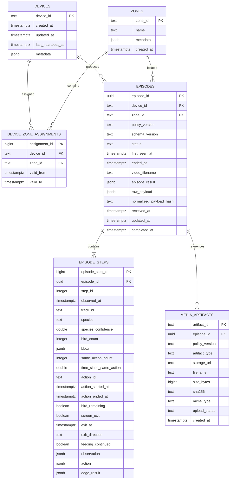

# WCD 서버 데이터베이스 구조 v0.1

  

## 1. 문서 개요

  

이 문서는 현재 구현된 핵심 MVP PostgreSQL 스키마를 설명한다.

  

- DBMS: PostgreSQL

- ORM: SQLAlchemy 2.x

- Migration: Alembic

- 현재 revision: `20260805_0001`

- 세션 시간대: `Asia/Seoul`

- 구현 범위: 장치, 구역, Episode, Episode step, 미디어 artifact

- 아직 구현하지 않은 범위: Agent, 사람 검수, Handoff, 정책, catalog 관련 테이블

  

스키마의 구현 원본은 다음 파일이다.

  

- `src/wcd_server/models/base.py`

- `src/wcd_server/models/device.py`

- `src/wcd_server/models/episode.py`

- `src/wcd_server/models/artifact.py`

- `alembic/versions/20260805_0001_core_mvp.py`

  

## 2. 테이블 목록

  

| 테이블 | 역할 |

|---|---|

| `devices` | Jetson 장치와 heartbeat 정보를 저장한다. |

| `zones` | 조류 퇴치 시스템의 운영 구역을 저장한다. |

| `device_zone_assignments` | 장치가 어느 구역에 배정되었는지 기간별로 저장한다. |

| `episodes` | Jetson에서 수신한 사건 metadata, 처리 상태 및 원본 payload를 저장한다. |

| `episode_steps` | Episode의 단계별 관찰, 행동 및 edge 결과를 저장한다. |

| `media_artifacts` | MP4·frame 등 외부 저장소 파일의 참조와 무결성 정보를 저장한다. |

  

## 3. ERD

  



  

## 4. 테이블 상세

  

### 4.1 `devices`

  

Jetson 장치를 식별하고 장치별 metadata와 마지막 heartbeat 시각을 저장한다.

  

| 컬럼 | PostgreSQL 타입 | Null | 제약/설명 |

|---|---|---:|---|

| `device_id` | `TEXT` | 아니오 | PK |

| `created_at` | `TIMESTAMPTZ` | 아니오 | 생성 시각 |

| `updated_at` | `TIMESTAMPTZ` | 아니오 | 수정 시각 |

| `last_heartbeat_at` | `TIMESTAMPTZ` | 예 | 마지막 heartbeat 시각 |

| `metadata` | `JSONB` | 아니오 | 기본값 `{}` |

  

### 4.2 `zones`

  

장치와 Episode가 속하는 운영 구역을 저장한다.

  

| 컬럼 | PostgreSQL 타입 | Null | 제약/설명 |

|---|---|---:|---|

| `zone_id` | `TEXT` | 아니오 | PK |

| `name` | `TEXT` | 아니오 | 구역 이름 |

| `metadata` | `JSONB` | 아니오 | 기본값 `{}` |

| `created_at` | `TIMESTAMPTZ` | 아니오 | 생성 시각 |

  

`name`의 UNIQUE 제약은 아직 확정되지 않아 적용하지 않았다.

  

### 4.3 `device_zone_assignments`

  

장치와 구역의 배정 이력을 기간 단위로 저장한다.

  

| 컬럼 | PostgreSQL 타입 | Null | 제약/설명 |

|---|---|---:|---|

| `assignment_id` | `BIGINT` | 아니오 | Identity PK |

| `device_id` | `TEXT` | 아니오 | `devices.device_id` FK |

| `zone_id` | `TEXT` | 아니오 | `zones.zone_id` FK |

| `valid_from` | `TIMESTAMPTZ` | 아니오 | 배정 시작 시각 |

| `valid_to` | `TIMESTAMPTZ` | 예 | 배정 종료 시각 |

  

CHECK:

  

```sql

valid_to IS NULL OR valid_to >= valid_from

```

  

동일 기간의 중복·겹침을 막는 exclusion 제약은 아직 확정되지 않았다.

  

### 4.4 `episodes`

  

Jetson의 `EpisodeCreateV1`을 정규화하여 저장하는 핵심 사건 테이블이다.

  

| 컬럼 | PostgreSQL 타입 | Null | 제약/설명 |

|---|---|---:|---|

| `episode_id` | `UUID` | 아니오 | PK, Jetson 생성 UUIDv4 |

| `device_id` | `TEXT` | 아니오 | `devices.device_id` FK |

| `zone_id` | `TEXT` | 아니오 | `zones.zone_id` FK |

| `policy_version` | `TEXT` | 아니오 | 정책 버전 문자열; 정책 FK는 아직 없음 |

| `schema_version` | `TEXT` | 아니오 | Episode 계약 버전 |

| `status` | `TEXT` | 아니오 | 허용 상태 CHECK 적용 |

| `first_seen_at` | `TIMESTAMPTZ` | 아니오 | 최초 탐지 시각 |

| `ended_at` | `TIMESTAMPTZ` | 예 | Episode 종료 시각 |

| `video_filename` | `TEXT` | 아니오 | 업로드 예정 MP4 파일명 |

| `episode_result` | `JSONB` | 아니오 | Episode 결과 원문 |

| `raw_payload` | `JSONB` | 아니오 | 수신한 EpisodeCreateV1 원문 |

| `normalized_payload_hash` | `TEXT` | 예 | 컬럼만 존재하며 아직 계산하지 않음 |

| `received_at` | `TIMESTAMPTZ` | 아니오 | 서버 수신 시각 |

| `updated_at` | `TIMESTAMPTZ` | 아니오 | 최종 수정 시각 |

| `completed_at` | `TIMESTAMPTZ` | 예 | complete 검증 완료 시각 |

  

허용 상태:

  

```text

METADATA_RECEIVED

VIDEO_PENDING

VIDEO_RECEIVED

COMPLETED

INVALID

FAILED

```

  

시간 CHECK:

  

```sql

ended_at IS NULL OR ended_at >= first_seen_at

```

  

인덱스:

  

- `(policy_version, first_seen_at DESC)`

- `(device_id, first_seen_at DESC)`

- `(zone_id, first_seen_at DESC)`

- `(status, received_at)`

  

### 4.5 `episode_steps`

  

Episode의 `steps[]`를 단계별 행으로 정규화한다. 중첩 객체 원문도 JSONB로 함께 보존한다.

  

| 컬럼 | PostgreSQL 타입 | Null | 제약/설명 |

|---|---|---:|---|

| `episode_step_id` | `BIGINT` | 아니오 | Identity PK |

| `episode_id` | `UUID` | 아니오 | `episodes.episode_id` FK |

| `step_id` | `INTEGER` | 아니오 | Episode 내부 step 번호 |

| `observed_at` | `TIMESTAMPTZ` | 아니오 | 관찰 시각 |

| `track_id` | `TEXT` | 아니오 | 추적 ID |

| `species` | `TEXT` | 아니오 | catalog 검증 전까지 문자열 보존 |

| `species_confidence` | `DOUBLE PRECISION` | 아니오 | 0 이상 1 이하 |

| `bird_count` | `INTEGER` | 아니오 | 0 이상 |

| `bbox` | `JSONB` | 아니오 | 4개 정수의 픽셀 XYXY |

| `same_action_count` | `INTEGER` | 아니오 | 0 이상 |

| `time_since_same_action` | `DOUBLE PRECISION` | 예 | 반복 행동 경과값; 단위 TBD |

| `action_id` | `TEXT` | 아니오 | catalog 검증 전까지 문자열 보존 |

| `action_started_at` | `TIMESTAMPTZ` | 아니오 | 행동 시작 시각 |

| `action_ended_at` | `TIMESTAMPTZ` | 아니오 | 행동 종료 시각 |

| `bird_remaining` | `BOOLEAN` | 아니오 | 행동 후 조류 잔존 여부 |

| `screen_exit` | `BOOLEAN` | 아니오 | 화면 이탈 여부 |

| `exit_at` | `TIMESTAMPTZ` | 예 | 화면 이탈 시각 |

| `exit_direction` | `TEXT` | 예 | 이탈 방향 |

| `feeding_continued` | `BOOLEAN` | 아니오 | 섭식 지속 여부 |

| `observation` | `JSONB` | 아니오 | observation 원문 |

| `action` | `JSONB` | 아니오 | action 원문 |

| `edge_result` | `JSONB` | 아니오 | edge result 원문 |

  

UNIQUE:

  

```sql

UNIQUE (episode_id, step_id)

```

  

CHECK 요약:

  

```sql

0 <= species_confidence AND species_confidence <= 1

bird_count >= 0

same_action_count >= 0

action_ended_at >= action_started_at

```

  

`time_since_same_action` 규칙:

  

```sql

(same_action_count = 0 AND time_since_same_action IS NULL)

OR

(same_action_count >= 1

AND time_since_same_action IS NOT NULL

AND time_since_same_action >= 0)

```

  

`bbox` 규칙:

  

- JSONB array

- 원소 수 4개

- 네 원소가 모두 JSON number

- 네 값이 모두 정수

- `x_min < x_max`

- `y_min < y_max`

  

인덱스:

  

- `(episode_id, observed_at)`

  

### 4.6 `media_artifacts`

  

파일 본문은 PostgreSQL에 저장하지 않는다. 객체 저장소의 위치와 파일 무결성 정보만 저장한다.

  

| 컬럼 | PostgreSQL 타입 | Null | 제약/설명 |

|---|---|---:|---|

| `artifact_id` | `TEXT` | 아니오 | PK |

| `episode_id` | `UUID` | 예 | `episodes.episode_id` FK |

| `policy_version` | `TEXT` | 예 | 정책 artifact 연결용; 정책 FK는 아직 없음 |

| `artifact_type` | `TEXT` | 아니오 | VIDEO, FRAME 등; 전체 목록 TBD |

| `storage_uri` | `TEXT` | 아니오 | 실제 backend와 경로 규칙 TBD |

| `filename` | `TEXT` | 아니오 | 파일명 |

| `size_bytes` | `BIGINT` | 아니오 | 0 이상 |

| `sha256` | `TEXT` | 아니오 | 64자리 hexadecimal |

| `mime_type` | `TEXT` | 아니오 | MIME type |

| `upload_status` | `TEXT` | 아니오 | 전체 상태 목록 TBD |

| `created_at` | `TIMESTAMPTZ` | 아니오 | 생성 시각 |

  

CHECK:

  

```sql

size_bytes >= 0

sha256 ~ '^[0-9A-Fa-f]{64}$'

```

  

인덱스:

  

- `(episode_id, artifact_type)`

- `(sha256)` — 비고유 인덱스

  

## 5. FK 삭제 정책

  

현재 구현된 모든 FK는 기본적으로 `ON DELETE RESTRICT`를 사용한다.

  

- 장치 또는 구역을 참조하는 배정·Episode가 있으면 부모 행을 삭제할 수 없다.

- Step 또는 artifact가 연결된 Episode를 삭제할 수 없다.

- 감사·추적 데이터를 cascade로 자동 삭제하지 않는다.

  

실제 보존 기간과 삭제 절차는 아직 TBD다.

  

## 6. JSONB 저장 원칙

  

정규 컬럼과 원본 JSONB를 함께 저장한다.

  

| JSONB 컬럼 | 목적 |

|---|---|

| `devices.metadata` | 장치 확장 metadata |

| `zones.metadata` | 구역 확장 metadata |

| `episodes.episode_result` | Episode 결과 원문 |

| `episodes.raw_payload` | EpisodeCreateV1 전체 수신 원문 |

| `episode_steps.bbox` | 픽셀 XYXY 배열 |

| `episode_steps.observation` | observation 원문 |

| `episode_steps.action` | action 원문 |

| `episode_steps.edge_result` | edge result 원문 |

  

ID, 상태, 시각, confidence, count 및 조회 조건은 별도 정규 컬럼으로 유지한다.

  

## 7. Naming convention

  

Alembic과 SQLAlchemy metadata는 다음 규칙을 사용한다.

  

```text

ix_%(column_0_label)s

uq_%(table_name)s_%(column_0_name)s

ck_%(table_name)s_%(constraint_name)s

fk_%(table_name)s_%(column_0_name)s_%(referred_table_name)s

pk_%(table_name)s

```

  

예:

  

- `pk_episodes`

- `uq_episode_steps_episode_id`

- `ck_episode_steps_species_confidence_range`

- `fk_episode_steps_episode_id_episodes`

- `ix_episodes_policy_version`

  

## 8. Migration 실행

  

### 개발 DB

  

```bash

WCD_DATABASE_URL='postgresql+asyncpg://...' \

.venv/bin/alembic upgrade head

```

  

현재 revision 확인:

  

```bash

.venv/bin/alembic current

.venv/bin/alembic heads

```

  

되돌리기:

  

```bash

WCD_DATABASE_URL='postgresql+asyncpg://...' \

.venv/bin/alembic downgrade base

```

  

### 테스트 DB 안전 규칙

  

Migration 테스트는 `agent_dev`를 사용하지 않고 `agent_dev_test`만 사용한다.

  

```bash

WCD_ALEMBIC_ENV=test \

WCD_TEST_DATABASE_URL='postgresql+asyncpg://.../agent_dev_test' \

.venv/bin/alembic upgrade head

```

  

테스트 코드는 URL의 database 이름이 정확히 `agent_dev_test`인지 확인한다. 실제 비밀번호나 전체 접속 URL은 코드와 fixture에 저장하지 않는다.

  

## 9. 현재 보류된 사항

  

- `zones.name` UNIQUE 여부

- 장치·구역 배정 기간 중복 방지 방식

- species, action ID, Episode result catalog FK와 membership

- artifact type 및 upload status 목록

- artifact가 Episode 또는 Policy 중 하나에만 속하도록 하는 소유권 CHECK

- `normalized_payload_hash` 계산과 canonical JSON

- 객체 저장소 backend·경로·임시 객체 정책

- 운영 seed 데이터

- retention 및 삭제 절차

- 3B Agent, HumanReview, Handoff, Policy, Catalog 테이블